# Orquestração de Agentes CloudSix

## Objetivo

Definir como agentes especialistas devem ser chamados, em qual ordem, com quais entradas e quais limites devem respeitar ao colaborar em projetos de software empresarial, em coordenação com os meta-agentes descritos em `meta-agents`.

## Contexto

Projetos CloudSix podem envolver negócio, produto, arquitetura, banco de dados, backend, frontend, mobile, segurança, performance, QA, DevOps, documentação, IA, SEO e refatoração. Nenhum agente deve trabalhar isolado quando sua decisão impactar outro domínio.

Todos os agentes devem operar de forma stack-agnóstica: primeiro observam o projeto, depois propõem ações compatíveis com a realidade encontrada.

Em projetos consumidores da CEIP, agentes devem consultar duas fontes: o CEIP Core em `.cloudsix/method` e o CEIP Workspace em `.ceip/`. O Core define método e governança; o Workspace define contexto local do projeto.

Demandas de novo produto, nova funcionalidade, novo módulo, nova API, nova integração ou mudança relevante de escopo devem passar pelo `product-intelligence/` antes de Business Analyst, Product Manager, Policy Engine, Orchestrator, Architecture ou Engineering. O Product Intelligence System produz discovery, PRD, requisitos, MVP, roadmap, features, stories e critérios de aceite.

Demandas que impactem interface, fluxo visual, dashboard, formulário, tabela, site, componente composto ou experiência responsiva devem passar pelo `product-experience/` antes de UX, UI, Frontend, QA ou release. O Product Experience System produz critérios de experiência, layout, interação, acessibilidade, Design Review, Visual Quality Score e evidências para o Product Experience Gate.

Antes de atuar, agentes devem consultar `constitution/constitution.md` e as leis específicas do domínio impactado. Em demandas complexas, a sequência deve seguir `ORCHESTRATOR.md`.

O roteamento oficial por tipo de tarefa fica em `policy-engine/AGENT_ROUTING_POLICIES.md`. Quando houver dúvida sobre risco, gates ou aprovação, o agente deve parar a recomendação e acionar Policy Engine, Risk Engine e Approval Engine.

## Diretrizes globais

- Todo agente deve identificar stack, arquitetura, padrões locais e restrições antes de recomendar implementação.
- Todo agente deve verificar se existe passagem pelo Product Intelligence System quando a demanda envolver produto, feature, módulo, API ou integração relevante.
- Todo agente deve verificar se existe passagem pelo Product Experience System quando a demanda envolver interface ou experiência visual relevante.
- Nenhum agente pode inventar requisito, regra de negócio, integração, tela, API ou dado.
- Nenhum agente técnico deve iniciar arquitetura ou implementação de iniciativa relevante sem PRD, critérios de aceite ou exceção formal pelo Policy Engine.
- Nenhum agente frontend deve decidir aparência, layout ou qualidade visual sem consultar PXS, design system local e critérios de experiência aplicáveis.
- Nenhum agente deve contornar o Policy Engine antes do Orchestrator em tarefa relevante.
- Nenhum agente altera regra de negócio sem solicitação explícita e validação de impacto.
- Toda recomendação deve distinguir fato observado, inferência e hipótese.
- Toda decisão relevante deve registrar justificativa, alternativa rejeitada e risco residual.
- Agentes devem preferir evolução incremental, compatibilidade retroativa e mudanças testáveis.
- Quando houver conflito entre agentes, o Chief Software Architect coordena a resolução técnica e o Product Manager valida impacto de produto.
- Quando houver conflito estratégico, gate falho ou divergência entre qualidade e prazo, acionar meta-agentes.
- Todo agente deve produzir handoff suficiente para o próximo agente, conforme `orchestrator/handoff-protocol.md`.
- Todo agente deve respeitar quality gates e score mínimo aplicáveis ao risco da entrega.
- Todo agente deve registrar decisões, reviews e aprendizados no `.ceip/` do projeto quando estiver atuando em projeto consumidor.
- Nenhum agente deve copiar o CEIP Core para `.ceip/`.

## Meta-agentes

| Meta-agente | Quando chamar |
| --- | --- |
| Chief Engineering Officer | Conflitos estratégicos, decisões de alto impacto, exceções às leis |
| Technical Program Manager | Demandas com múltiplos agentes, dependências ou fases |
| Quality Governor | Validação de quality gates, scorecards e bloqueios |
| Knowledge Curator | Registro de aprendizados, ADRs, RFCs, patterns e anti-patterns |

## Ordem recomendada por tipo de trabalho

```mermaid
flowchart LR
    A["Ideia / Demanda"] --> A1["Product Intelligence System"]
    A1 --> A2["Discovery / PRD"]
    A2 --> B["Business Analyst"]
    B --> C["Product Manager"]
    C --> D["Policy Engine"]
    D --> E["Orchestrator"]
    E --> F{"Interface impactada?"}
    F -->|Sim| G["Product Experience System"]
    G --> H["UX / UI"]
    F -->|Nao| I["Specialist Agents"]
    H --> I
    I --> J["Architecture"]
    J --> K["Planning"]
    K --> L["Implementation"]
    L --> M["Review"]
    M --> N["Quality Gates"]
    N --> O["Score Engine"]
    O --> P["Release"]
    P --> Q["Memory / Learning"]
```

## Catálogo de agentes

| Agente | Quando chamar | Saída esperada |
| --- | --- | --- |
| Product Intelligence System | Ideia, novo produto, nova feature, novo módulo, API, integração ou mudança relevante de escopo | discovery, PRD, requisitos, MVP, roadmap, stories e critérios de aceite |
| Product Experience System | Tela, fluxo visual, dashboard, formulário, tabela, site, componente composto ou experiência responsiva | experience brief, layout, interação, acessibilidade, design review, Visual Quality Score e Product Experience Gate |
| Business Analyst | Entendimento de domínio, regra de negócio, processo operacional | requisitos, fluxos, critérios de aceite |
| Product Manager | Priorização, escopo, valor, roadmap | recorte de entrega, trade-offs, métricas |
| Chief Software Architect | Decisão estrutural, dependência crítica, integração entre módulos | proposta técnica, ADR, riscos |
| Database Architect | Modelagem, migração, consistência, histórico, volume | modelo lógico, plano de migração, riscos de dados |
| Backend Engineer | Regras de aplicação, serviços, jobs, contratos internos | design de implementação backend |
| API Integration Engineer | APIs, webhooks, autenticação externa, contratos de integração | contrato, mapeamento, idempotência |
| Frontend UX Specialist | Jornada, usabilidade, acessibilidade e estados depois do PXS quando aplicável | fluxo de UX, critérios de interação |
| UI Designer | Interface visual, componentes e consistência visual depois do PXS quando aplicável | especificação visual, componentes, estados e tokens locais |
| Mobile Specialist | Experiência móvel, offline, performance em dispositivos | diretrizes mobile e riscos |
| Security Engineer | Autorização, autenticação, exposição de dados, ameaças | análise de risco e controles |
| Performance Engineer | Latência, throughput, consumo, cache, gargalos | plano de medição e otimização |
| QA Engineer | Estratégia de testes, regressão, aceite | plano de teste e matriz de cobertura |
| Code Reviewer Tech Lead | Revisão técnica, coesão, manutenibilidade | parecer de revisão e bloqueios |
| Documentation Engineer | Documentação de decisão, uso e operação | documentação atualizada |
| DevOps Engineer | Deploy, ambientes, observabilidade, rollback | plano operacional |
| AI Engineer | Automação com IA, prompts, avaliação, segurança de IA | desenho de solução com IA |
| SEO Marketing Engineer | Sites, conteúdo indexável, performance de marketing | recomendações SEO e tracking |
| Refactoring Specialist | Redução de dívida técnica sem mudar comportamento | plano incremental e testes de caracterização |

## Exemplos

- Feature SaaS com nova tela e API: Product Intelligence System, Business Analyst, Product Manager, Policy Engine, Orchestrator, Product Experience System, Architecture, Backend/API, Frontend UX, UI Designer, Security, QA, Code Reviewer Tech Lead e Documentation Engineer.
- Nova iniciativa de produto: Product Intelligence System, Discovery, PRD, Business Analyst, Product Manager, Policy Engine, Orchestrator, Architecture e agentes por impacto.
- Migração de banco em ERP: Business Analyst, Chief Software Architect, Database Architect, Backend Engineer, QA Engineer, DevOps Engineer, Security Engineer.
- Incidente de produção: DevOps Engineer, Backend Engineer, Database Architect quando houver dados, Security Engineer quando houver suspeita de exposição, Documentation Engineer para registro pós-incidente.
- Mudança de alto risco: Policy Engine classifica risco, Orchestrator define agentes, Review Engine executa rodadas, Quality Engine aplica gates e Approval Engine decide avanço.
- Projeto consumidor com Workspace: ler `.cloudsix/method/POLICY_ENGINE.md`, depois `.ceip/PROJECT.md`, `.ceip/STACK.md` e `.ceip/CONTEXT.md` antes de selecionar agentes.

## Checklist

- [ ] O agente correto foi escolhido para o tipo de decisão.
- [ ] Product Intelligence System foi acionado quando a demanda envolveu produto, feature, módulo, API ou integração relevante.
- [ ] Product Experience System foi acionado quando a demanda envolveu interface ou experiência visual relevante.
- [ ] PRD, critérios de aceite, MVP ou exceção formal existem antes de arquitetura ou implementação.
- [ ] Product Experience Gate e Visual Quality Score foram aplicados quando havia tela, fluxo, dashboard, formulário, tabela, site ou experiência responsiva.
- [ ] Policy Engine foi aplicado antes do Orchestrator em tarefa relevante.
- [ ] As entradas fornecidas incluem contexto, restrições e objetivo.
- [ ] A ordem de acionamento evita decisões técnicas antes do entendimento do problema.
- [ ] Dependências entre agentes foram explicitadas.
- [ ] Saídas esperadas foram registradas e verificáveis.
- [ ] Meta-agentes foram acionados quando houve coordenação, gate ou aprendizado.
- [ ] Routing policy, handoff e gates foram aplicados quando necessário.
- [ ] Core e Workspace foram consultados quando a tarefa ocorreu em projeto consumidor.

## Conclusão

Agentes são papéis de responsabilidade, não atalhos para decisão automática. A qualidade do resultado depende de contexto real, validação cruzada e respeito aos limites de cada especialidade.
