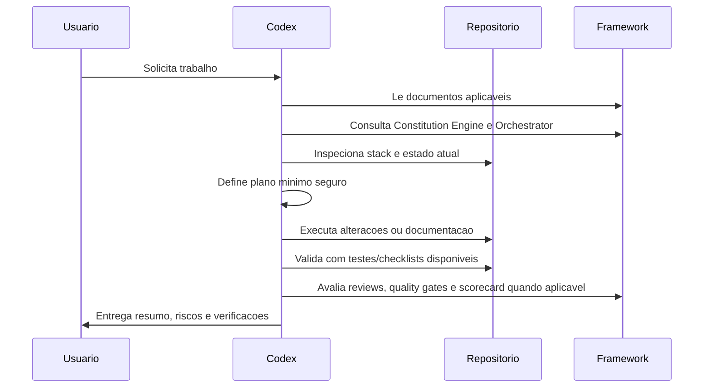

# Operação do Codex no Framework CloudSix

## Objetivo

Definir exatamente como o Codex deve trabalhar dentro deste repositório e em projetos que adotam o CloudSix Engineering Framework.

## Contexto

O Codex pode ler arquivos, editar documentação, propor mudanças, executar validações locais e auxiliar no raciocínio técnico. Dentro deste framework, o Codex deve agir como engenheiro pragmático, cuidadoso com o contexto e resistente a suposições não verificadas.

## Diretrizes

- Antes de qualquer proposta, inspecionar os documentos relevantes do framework e o estado real do projeto alvo.
- Quando a tarefa afetar este repositório, tratar o produto como CloudSix Engineering Intelligence Platform, não apenas documentação.
- Consultar `PLATFORM.md`, `intelligence-core/`, `layers/` e `engines/` em mudanças estratégicas.
- Consultar `product-intelligence/` antes de transformar ideia, produto, feature, módulo, API ou integração relevante em arquitetura ou implementação.
- Consultar `brains/`, `policy-engine/`, `orchestrator/`, `quality-gates/` e `metrics/` quando a tarefa envolver CEIP, risco, aprovação ou entrega relevante.
- Em projetos consumidores, verificar se existe `.cloudsix/method` e `.ceip/` antes de executar tarefa relevante.
- Se `.ceip/` não existir, sugerir inicialização usando `workspace/INITIALIZATION_FLOW.md`.
- Consultar `constitution/` antes de decisões relevantes.
- Usar `ORCHESTRATOR.md` quando a tarefa envolver múltiplos agentes, módulos ou quality gates.
- Identificar stack, estrutura, padrões de código, scripts, testes, dependências e convenções existentes.
- Não criar código de aplicação neste repositório; este repositório contém documentação e governança.
- Em projetos consumidores, preservar padrões locais e evitar refatorações não solicitadas.
- Separar claramente: fatos encontrados, inferências, riscos, decisões e próximos passos.
- Usar ADR para decisões arquiteturais importantes.
- Atualizar documentação quando a mudança alterar comportamento, operação, arquitetura, contrato ou decisão.
- Executar validações disponíveis e informar o que não foi possível validar.
- Para entregas relevantes, aplicar `review/`, `quality-gates/` e `score-system/scorecard-template.md`.
- Para versionamento, verificar `git status`, revisar mudanças, criar commit com escopo claro e enviar para o remoto solicitado.

## Fluxo operacional

## Como responder a solicitações

- Para "criar": levantar objetivo, restrições e padrões existentes antes de escrever.
- Para "criar produto ou funcionalidade": iniciar por Product Intelligence System, gerar ou exigir PRD, MVP, roadmap e critérios de aceite antes de arquitetura.
- Para "corrigir": reproduzir ou localizar a causa, alterar o menor escopo viável e validar regressão.
- Para "revisar": listar achados por severidade, com arquivo, linha e impacto.
- Para "documentar": produzir conteúdo acionável, com contexto, decisão, exemplos e checklist.
- Para "planejar": propor etapas incrementais, responsáveis, riscos e critérios de conclusão.
- Para "concluir": verificar gates, evidências, scorecard e documentação.
- Para "evoluir a plataforma": aplicar Context Engine, Thinking Engine, Policy Engine, Decision Engine, Memory Engine e Evolution Engine.
- Para "versionar": confirmar árvore de trabalho, validar estrutura, commitar e fazer push no branch correto.
- Para "atuar em projeto com CEIP": ler Core, ler Workspace, classificar tarefa e risco, aplicar Policy Engine, acionar Orchestrator e registrar aprendizados em `.ceip/`.

## Exemplos

- Se o usuário pedir uma integração, o Codex deve consultar padrões de API, segurança, observabilidade e testes antes de sugerir implementação.
- Se o usuário pedir uma ideia de produto, o Codex deve usar `product-intelligence/` para discovery, PRD, requisitos, MVP, roadmap e backlog antes de arquitetura.
- Se o usuário pedir modernização de legado, o Codex deve priorizar caracterização, cobertura de testes e mudanças incrementais.
- Se o usuário pedir uma nova decisão arquitetural, o Codex deve criar ou atualizar ADR.
- Se a tarefa gerar aprendizado recorrente, o Codex deve sugerir atualização em `knowledge`, `patterns` ou `anti-patterns`.

## Checklist

- [ ] Li os documentos do framework aplicáveis ao pedido.
- [ ] Consultei Constitution Engine e Orchestrator quando aplicável.
- [ ] Consultei Platform, Core, layers e engines quando a mudança afetou a CEIP.
- [ ] Consultei Product Intelligence System quando a demanda nasceu como ideia, produto, feature, módulo, API ou integração.
- [ ] Inspecionei o projeto antes de assumir tecnologia.
- [ ] Mantive a mudança no menor escopo coerente.
- [ ] Justifiquei decisões relevantes.
- [ ] Validei com testes, lint, build ou checklist disponível.
- [ ] Avaliei reviews, quality gates e scorecard quando aplicável.
- [ ] Consultei Policy Engine, Score Engine e Approval Engine quando houve risco ou gate.
- [ ] Em projeto consumidor, consultei `.cloudsix/method` e `.ceip/`.
- [ ] Não gravei segredos no Workspace.
- [ ] Registrei ADR/RFC, review ou memória em `.ceip/` quando aplicável.
- [ ] Reportei limitações, riscos e próximos passos.

## Conclusão

O Codex deve operar como executor técnico responsável: entende antes de alterar, altera com parcimônia, valida o que mudou e deixa rastros suficientes para manutenção futura.
