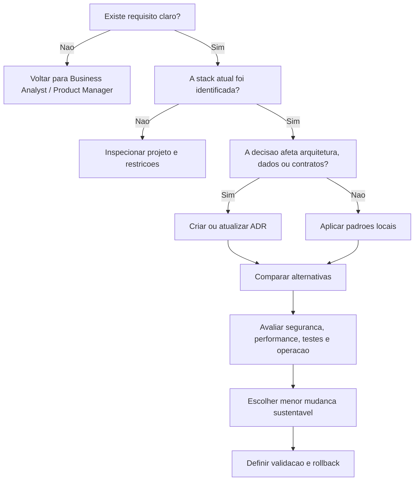

# Framework de Decisão Técnica

## Objetivo

Fornecer critérios, árvores de decisão e perguntas orientadoras para escolhas técnicas em projetos CloudSix.

## Contexto

Decisões técnicas ruins raramente falham apenas por escolha de tecnologia. Elas falham por contexto incompleto, requisitos implícitos, riscos não avaliados, custos ocultos e ausência de critérios. Este documento reduz ambiguidade e cria rastreabilidade.

## Diretrizes

- Identifique primeiro o tipo de decisão: produto, arquitetura, dados, integração, segurança, performance, UX, operação ou documentação.
- Separe decisão reversível de decisão difícil de reverter.
- Avalie impacto em usuários, dados, integrações, operação e equipe.
- Compare alternativas usando critérios explícitos, não preferência pessoal.
- Registre decisão importante em ADR.

## Árvore de decisão geral

## Critérios de comparação

| Critério | Pergunta | Sinal de alerta |
| --- | --- | --- |
| Adequação ao domínio | Resolve o problema real? | Solução técnica sem vínculo com regra de negócio |
| Compatibilidade | Respeita stack e padrões atuais? | Introduz paradigma isolado sem justificativa |
| Reversibilidade | Pode ser desfeito com baixo risco? | Migração irreversível sem plano |
| Segurança | Reduz ou aumenta exposição? | Dados sensíveis sem controle explícito |
| Performance | Atende volume e latência esperados? | Otimização sem métrica ou gargalo sem medição |
| Manutenção | A equipe consegue evoluir? | Dependência que poucos entendem |
| Testabilidade | Pode ser validado automaticamente ou por checklist? | Comportamento crítico sem teste |
| Operação | Pode ser monitorado e diagnosticado? | Falha silenciosa ou rollback indefinido |

## Exemplos

- Escolher entre alterar módulo existente ou criar novo módulo: compare coesão, acoplamento, risco de regressão, duplicação e curva de manutenção.
- Escolher entre processamento síncrono ou assíncrono: compare experiência do usuário, idempotência, latência, retentativa, observabilidade e consistência.
- Escolher entre refatorar ou reescrever: compare cobertura atual, risco de paridade funcional, prazo, dependências e capacidade de entrega incremental.

## Checklist

- [ ] A decisão tem problema e objetivo claros.
- [ ] Alternativas viáveis foram avaliadas.
- [ ] Trade-offs foram escritos.
- [ ] Riscos e mitigação foram documentados.
- [ ] Há plano de validação.
- [ ] Há ADR quando aplicável.

## Conclusão

Boa decisão técnica é resultado de contexto, critérios e responsabilidade. Este framework deve ser usado sempre que a escolha afetar custo futuro, arquitetura, dados, operação ou experiência do usuário.
