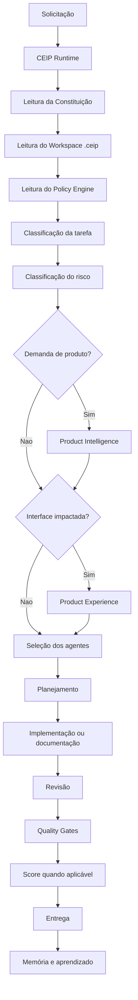

# Manual de Utilização da CloudSix Engineering Intelligence Platform

## Objetivo

Explicar como integrar a CloudSix Engineering Intelligence Platform (CEIP) em qualquer projeto de software, permitindo que agentes de IA como Codex, Claude Code, Gemini CLI, Cursor, Windsurf, GitHub Copilot e outros utilizem o framework como base de governança técnica durante o desenvolvimento.

A CEIP não é um framework de código. Ela é uma plataforma de engenharia composta por documentação, governança, políticas, agentes especialistas, mecanismos de decisão, padrões de qualidade, memória organizacional e critérios de validação.

A arquitetura oficial é dividida em:

- CEIP Core: este repositório, instalado ou referenciado como método global.
- CEIP Workspace: a pasta `.ceip/` criada em cada projeto consumidor para guardar contexto local.

## Requisitos

Antes de iniciar, é necessário possuir:

- Git instalado.
- Um repositório Git do projeto consumidor.
- Acesso ao repositório oficial da CEIP.
- Permissão para alterar o projeto consumidor, quando a integração for feita por submodule.

Repositório oficial:

```text
https://github.com/thyags/method-ceip
```

## Direitos autorais

© 2026 CloudSix Sistemas e Tecnologia Ltda. Todos os direitos reservados.

O repositório público permite consulta e integração operacional autorizada, mas não concede licença aberta. A CEIP, seus documentos, templates, prompts, engines, agentes, políticas, CLI e demais artefatos permanecem protegidos por direitos autorais. Consulte `LICENSE.md` antes de reutilizar, redistribuir ou modificar o método fora de autorização expressa.

Alternativa via SSH:

```text
git@github.com:thyags/method-ceip.git
```

## Método recomendado de integração

A forma recomendada é utilizar o repositório da CEIP como um Git submodule dentro do projeto consumidor e criar um Workspace local `.ceip/`.

Isso permite:

- Reutilizar o framework em vários projetos.
- Atualizar o método independentemente do projeto.
- Manter uma única fonte oficial de documentação.
- Facilitar evolução contínua da plataforma.
- Evitar cópias divergentes da CEIP em cada projeto.
- Manter contexto específico do cliente separado do método global.

## Passo 1 - Adicionar o CEIP Core ao projeto

Na raiz do projeto consumidor, execute uma das opções abaixo.

Via HTTPS:

```bash
git submodule add https://github.com/thyags/method-ceip.git .cloudsix/method
```

Via SSH:

```bash
git submodule add git@github.com:thyags/method-ceip.git .cloudsix/method
```

Em seguida:

```bash
git add .
git commit -m "Adiciona CloudSix Engineering Intelligence Platform"
```

O projeto ficará organizado de forma semelhante a:

```text
MeuProjeto/
├── src/
├── app/
├── public/
├── AGENTS.md
└── .cloudsix/
    └── method/
        ├── README.md
        ├── MANUAL_DE_USO.md
        ├── AGENTS.md
        ├── CODEX.md
        ├── CONSTITUTION.md
        ├── runtime/
        ├── POLICY_ENGINE.md
        ├── ORCHESTRATOR.md
        ├── QUALITY_STANDARD.md
        └── ...
```

## Passo 2 - Criar o CEIP Workspace

Crie a pasta local do projeto:

```bash
mkdir -p .ceip
```

Use os templates em:

```text
.cloudsix/method/workspace/templates/
```

Arquivos mínimos recomendados:

```text
.ceip/PROJECT.md
.ceip/STACK.md
.ceip/CONTEXT.md
.ceip/CURRENT_FOCUS.md
.ceip/ARCHITECTURE_MAP.md
.ceip/QUALITY_DASHBOARD.md
.ceip/project.json
.ceip/runtime/
.ceip/product-intelligence/
.ceip/product-experience/
```

Consulte `workspace/WORKSPACE_STRUCTURE.md` para a estrutura completa.

## Passo 3 - Configurar o AGENTS.md do projeto

Na raiz do projeto consumidor, crie ou atualize um arquivo chamado:

```text
AGENTS.md
```

Conteúdo recomendado:

```md
# CloudSix Engineering Intelligence Platform

Este projeto utiliza oficialmente a CloudSix Engineering Intelligence Platform.

Toda atividade deve seguir as regras definidas no método.

Antes de qualquer alteração, consulte:

- .cloudsix/method/README.md
- .cloudsix/method/MANUAL_DE_USO.md
- .cloudsix/method/CONSTITUTION.md
- .cloudsix/method/runtime/README.md
- .cloudsix/method/runtime/context-loader.md
- .cloudsix/method/runtime/prompt-builder.md
- .cloudsix/method/AGENTS.md
- .cloudsix/method/CODEX.md
- .cloudsix/method/POLICY_ENGINE.md
- .cloudsix/method/ORCHESTRATOR.md
- .cloudsix/method/QUALITY_STANDARD.md
- .cloudsix/method/workspace/README.md
- .ceip/PROJECT.md
- .ceip/STACK.md
- .ceip/CONTEXT.md
- .ceip/runtime/README.md

Regras obrigatórias:

- Sempre usar CEIP Runtime, Context Loader e Prompt Builder quando houver execução assistida por IA.
- Nunca assumir tecnologias sem identificar a stack.
- Nunca alterar regra de negócio sem solicitação.
- Nunca inventar funcionalidades.
- Sempre classificar risco.
- Sempre aplicar o Policy Engine.
- Sempre respeitar os Quality Gates.
- Sempre preservar a arquitetura existente.
- Sempre registrar decisões relevantes.
- Sempre separar fatos, hipóteses e decisões.
- Sempre consultar Core + Workspace antes de tarefas relevantes.
- Nunca duplicar o Core dentro de .ceip/.
```

## Passo 4 - Atualizar a CEIP no projeto consumidor

Sempre que houver novas versões da CEIP:

```bash
cd .cloudsix/method
git pull origin main
cd ../..
git add .cloudsix/method
git commit -m "Atualiza CloudSix Engineering Intelligence Platform"
```

Se o projeto usar automação de dependências, trate a atualização do submodule como uma mudança revisável, com descrição do impacto no projeto consumidor.

## Passo 5 - Clonar um projeto já integrado

Caso outra pessoa clone o projeto pela primeira vez:

```bash
git clone --recurse-submodules <URL_DO_REPOSITORIO>
```

Se o projeto já tiver sido clonado sem submodules:

```bash
git submodule update --init --recursive
```

Para atualizar submodules depois do clone:

```bash
git submodule update --remote --merge
```

## Como utilizar com IA

Antes de solicitar qualquer implementação para uma IA, informe que o projeto utiliza a CEIP.

Prompt recomendado:

```text
Este projeto utiliza oficialmente a CloudSix Engineering Intelligence Platform (CEIP).

Antes de responder:

1. Consulte a documentação da CEIP presente em:

.cloudsix/method

2. Consulte obrigatoriamente:

- README.md
- MANUAL_DE_USO.md
- CONSTITUTION.md
- runtime/README.md
- runtime/context-loader.md
- runtime/prompt-builder.md
- AGENTS.md
- CODEX.md
- POLICY_ENGINE.md
- ORCHESTRATOR.md
- QUALITY_STANDARD.md
- product-intelligence/README.md
- product-experience/README.md
- workspace/README.md

3. Consulte também o Workspace local:

- .ceip/PROJECT.md
- .ceip/STACK.md
- .ceip/CONTEXT.md
- .ceip/runtime/README.md
- .ceip/CURRENT_FOCUS.md, quando existir

4. Use o CEIP Runtime para carregar contexto e montar o prompt quando houver execução assistida por IA.

5. Classifique a tarefa.

6. Classifique o risco.

7. Se envolver produto, feature, módulo, API ou integração, consulte Product Intelligence.

8. Se envolver interface, dashboard, formulário, tabela, site ou experiência responsiva, consulte Product Experience.

9. Identifique quais agentes devem participar.

10. Identifique os Quality Gates.

11. Identifique evidências necessárias para aprovação.

12. Somente depois apresente a solução.

Não ignore a CEIP.
Não implemente antes de realizar análise.
Não invente regra de negócio.
Não assuma tecnologia sem inspecionar o projeto.
Não avance em interface relevante sem Product Experience Gate e Visual Quality Score.
Registre decisões, reviews e aprendizados em .ceip/ quando aplicável.
```

## Fluxo esperado

Sempre que uma nova tarefa chegar, a IA ou pessoa responsável deve seguir este fluxo:



## Atualizações da plataforma

A CEIP deve evoluir continuamente.

Sempre que surgir:

- Novo padrão.
- Erro recorrente.
- Boa prática.
- Melhoria de processo.
- Lição aprendida.
- Lacuna de documentação.
- Falha de policy, gate, prompt ou agente.

O conhecimento deve ser registrado no repositório oficial da CEIP.

Destinos recomendados:

- `memory/` para memória operacional.
- `memory/lesson-learned-memory.md` para lições aprendidas.
- `knowledge/` para conhecimento por domínio.
- `patterns/` para padrões reutilizáveis.
- `anti-patterns/` para erros recorrentes.
- `pilots/` para validações em projetos reais.
- `validation/pilot-project-validation.md` para lacunas encontradas em piloto.
- `review/final-audit-report.md` para auditorias amplas da plataforma.
- `.ceip/memory/` para memória específica do projeto consumidor.
- `.ceip/product-intelligence/` para artefatos de produto do projeto.
- `.ceip/product-experience/` para decisões de experiência, score visual e memória local de interface.
- `.ceip/adr/` para decisões arquiteturais locais.
- `.ceip/rfc/` para propostas locais.
- `.ceip/reviews/` para revisões do projeto.

Nunca mantenha conhecimento importante apenas em projetos individuais.

## Como contribuir

Caso encontre melhorias:

1. Crie uma branch.

```bash
git checkout -b feature/minha-melhoria
```

2. Faça as alterações.

3. Revise estrutura, links e coerência.

```bash
git status
git diff --check
```

4. Commit.

```bash
git add .
git commit -m "Adiciona melhoria na documentação"
```

5. Envie para o GitHub.

```bash
git push origin feature/minha-melhoria
```

6. Abra um Pull Request.

Toda contribuição deve passar por revisão antes da incorporação ao método oficial.

## Como validar a CEIP em projetos reais

Para validar a CEIP em projetos reais, recomenda-se utilizar tarefas existentes e comparar os resultados obtidos com e sem o framework.

Critérios de avaliação:

- Clareza do diagnóstico.
- Organização da solução.
- Qualidade técnica.
- Respeito à arquitetura existente.
- Identificação correta dos riscos.
- Acionamento adequado dos agentes.
- Aplicação correta das políticas.
- Uso dos Quality Gates.
- Uso do Product Experience Gate quando houver interface relevante.
- Uso correto do Score Engine quando aplicável.
- Uso correto do Visual Quality Score quando aplicável.
- Facilidade de manutenção.
- Consistência da documentação.
- Capacidade de registrar aprendizado reutilizável.

Documentos de apoio:

- `docs/playbooks/projeto-piloto.md`
- `validation/pilot-project-validation.md`
- `pilots/gsa-oficina-pilot.md`
- `examples/03-pilot-scope-example.md`

## Boas práticas

- Utilize sempre a versão mais recente da CEIP.
- Não modifique diretamente o método dentro dos projetos consumidores.
- Contribua sempre no repositório oficial.
- Atualize os submodules periodicamente.
- Utilize o framework desde o início do projeto.
- Documente decisões importantes.
- Registre padrões reutilizáveis.
- Compartilhe aprendizados para fortalecer a plataforma.
- Mantenha o projeto consumidor agnóstico de tecnologia no uso da CEIP.
- Não use a CEIP como justificativa para alterar regra de negócio sem validação.

## Checklist de adoção

- [ ] Submodule foi adicionado em `.cloudsix/method`.
- [ ] Workspace local foi criado em `.ceip/`.
- [ ] Projeto consumidor tem `AGENTS.md` apontando para a CEIP.
- [ ] Pessoas e agentes sabem consultar `MANUAL_DE_USO.md`.
- [ ] Policy Engine é obrigatório antes de execução relevante.
- [ ] Orchestrator é usado para tarefas com múltiplos agentes.
- [ ] Product Intelligence é usado para demandas de produto.
- [ ] Product Experience é usado para interfaces relevantes.
- [ ] Quality Gates são usados antes de conclusão.
- [ ] Aprendizados retornam para o repositório oficial da CEIP.

## Objetivo final

A CloudSix Engineering Intelligence Platform não é apenas um conjunto de documentos.

Ela é uma plataforma de governança, inteligência e qualidade que busca padronizar o desenvolvimento de software, orientar agentes de IA e equipes humanas, preservar conhecimento organizacional e elevar o nível técnico dos projetos de forma consistente e evolutiva.

Ao utilizar a CEIP em diferentes projetos e receber feedback de uso real, o framework se torna mais robusto, maduro e capaz de apoiar o desenvolvimento de soluções cada vez mais confiáveis, sustentáveis e de alta qualidade.
