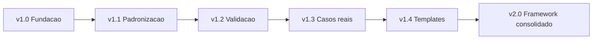

# Próximos Passos do Framework

## Objetivo

Transformar a CEIP de uma base documental completa em uma plataforma de inteligência de engenharia validada, revisada por especialistas e pronta para uso em projeto piloto.

## Contexto

A primeira versão do repositório criou a fundação: documentos-raiz, agentes, meta-agentes, constitution engine, decision trees, playbooks, templates, checklists, quality gates, knowledge base, patterns, anti-patterns, prompts e recipes. A evolução atual adiciona CEIP, Engineering Intelligence Core, layers, engines, policies, lifecycle e knowledge graph. A próxima etapa não deve ser "melhorar tudo" de forma ampla; deve amadurecer a plataforma em ciclos focados.

## Diretrizes

- Não alterar implementação durante uma rodada de geração ou auditoria estrutural.
- Separar revisão estrutural, revisão especializada, validação automatizável e teste em projeto real.
- Cada especialista deve revisar apenas sua área.
- Mudanças de conteúdo devem ser rastreáveis por rodada.
- O framework deve continuar agnóstico de tecnologia.
- Toda limitação recorrente deve virar módulo, engine ou policy.
- Não criar código de aplicação neste repositório.

## Fase 1 - Revisão estrutural

Objetivo: validar forma, presença e navegabilidade, sem discutir qualidade profunda do conteúdo.

Verificar:

- Todos os arquivos obrigatórios existem.
- A estrutura de pastas está correta.
- Não há documentos vazios.
- Títulos seguem padrão.
- Links internos principais estão coerentes.
- A navegação por `README.md`, `INDEX.md` e `ORCHESTRATOR.md` é compreensível.

Artefatos:

- `audits/0001-structural-review.md`
- `validation/structural-validation.md`
- `PLATFORM.md`
- `intelligence-core/README.md`

## Fase 2 - Revisão por especialistas

Objetivo: melhorar o framework por ciclos independentes e especializados.

Rodadas:

1. Chief Architect: arquitetura da documentação.
2. Documentation Engineer: linguagem, títulos, índice e referências.
3. Business Analyst: aplicabilidade a projetos reais.
4. QA Engineer: inconsistências, lacunas e critérios verificáveis.
5. Code Reviewer Tech Lead: qualidade geral da documentação e governança.

Artefatos:

- `specialist-reviews/01-chief-architect-review.md`
- `specialist-reviews/02-documentation-engineer-review.md`
- `specialist-reviews/03-business-analyst-review.md`
- `specialist-reviews/04-qa-review.md`
- `specialist-reviews/05-code-reviewer-review.md`

## Fase 3 - Suíte de validação

Objetivo: criar perguntas estruturadas para qualquer IA ou pessoa auditar o framework.

Validações:

- Arquitetura.
- Documentação.
- Segurança.
- Agentes.
- Workflows.
- Estrutura.
- Links e navegação.

Artefatos:

- `validation/README.md`
- `validation/architecture-validation.md`
- `validation/documentation-validation.md`
- `validation/security-validation.md`
- `validation/agent-validation.md`
- `validation/workflow-validation.md`

## Fase 4 - Projeto piloto

Objetivo: testar o framework em um projeto real da CloudSix antes de expandir para todos os projetos.

Projeto sugerido: GSA Oficina.

Critérios de observação:

- Os agentes funcionam?
- O fluxo faz sentido?
- A documentação é suficiente?
- A IA ficou perdida?
- Faltou algum documento?
- Quality gates ajudam ou atrapalham?
- O framework reduziu ambiguidade?

Artefatos:

- `pilots/README.md`
- `pilots/gsa-oficina-pilot.md`
- `pilots/project-validation-template.md`

## Ciclo de maturidade



## Ciclo operacional da CEIP

Consulte `lifecycle/README.md` para o ciclo completo:

Planejamento, construção, auto revisão, revisão especializada, validação, projeto piloto, lições aprendidas, atualização do framework e nova versão.

## Próximo grande passo: CLI CloudSix

Objetivo futuro: criar um CLI chamado `cloudsix-engineering` para operacionalizar o framework.

Comandos previstos:

```bash
cloudsix validate
cloudsix review
cloudsix architect
cloudsix plan
cloudsix agents backend
cloudsix agents ux
cloudsix adr create
cloudsix rfc create
cloudsix quality
```

O CLI deve:

- Localizar documentação relevante.
- Montar contexto para agentes.
- Executar checklists e validações.
- Gerar ADRs e RFCs.
- Preparar prompts para diferentes IAs.
- Avaliar quality gates.

Artefatos iniciais:

- `cli/README.md`
- `cli/commands.md`
- `cli/context-model.md`
- `cli/implementation-roadmap.md`

## Exemplos

- Antes de mudar conteúdo de agentes, rode a validação estrutural e a rodada de Documentation Engineer.
- Antes de usar em todos os clientes, execute o piloto no GSA Oficina.
- Antes de construir o CLI, valide manualmente quais comandos realmente reduzem trabalho.

## Checklist

- [ ] Fase 1 foi concluída sem mexer em conteúdo profundo.
- [ ] Rodadas especializadas foram executadas separadamente.
- [ ] Suíte de validação foi criada.
- [ ] Projeto piloto foi planejado.
- [ ] CLI foi especificado antes de qualquer implementação.
- [ ] Engineering Intelligence Core, engines e policies foram considerados em mudanças estratégicas.

## Conclusão

O próximo passo é maturidade operacional: revisar por especialidade, validar de forma repetível e testar em projeto real antes de escalar adoção.
