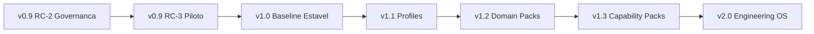

# Próximos Passos da CEIP

## Objetivo

Transformar a CEIP de release candidate aprovada em produto versionado, validado em projeto real e preparado para promoção segura a `v1.0.0`.

## Contexto

A CEIP já possui Core + Workspace, Runtime, Product Intelligence, Product Experience, CloudSix Design Language, Policy Engine, Orchestrator, Brains, Engines, Installer, Doctor, Validation Suite e CLI operacional inicial. A etapa atual não é criar mais módulos; é consolidar a plataforma como produto, validar em piloto real e impedir crescimento horizontal sem prova de valor.

## Diretrizes

- Não alterar implementação durante uma rodada de geração ou auditoria estrutural.
- Separar revisão estrutural, revisão especializada, validação automatizável e teste em projeto real.
- Cada especialista deve revisar apenas sua área.
- Mudanças de conteúdo devem ser rastreáveis por rodada.
- O framework deve continuar agnóstico de tecnologia.
- Toda limitação recorrente deve virar módulo, engine ou policy.
- Não criar código de aplicação neste repositório.
- Toda evolução de produto deve respeitar `GOVERNANCE.md`, `VERSIONING.md`, `RELEASE_PROCESS.md` e `RFC_PROCESS.md`.
- Para cada novo módulo estrutural, revisar ou melhorar pelo menos cinco ativos existentes relacionados.
- Novas capacidades sem evidência devem começar como plugin, Domain Pack, Capability Pack, RFC experimental ou artefato de Workspace.

## Fase atual - v0.9.0-rc.2

Objetivo: consolidar a CEIP como produto versionado.

Artefatos:

- `CHANGELOG.md`
- `VERSIONING.md`
- `RELEASE_PROCESS.md`
- `GOVERNANCE.md`
- `RFC_PROCESS.md`
- `CONTRIBUTING.md`
- `ROADMAP.md`

Critérios:

- Changelog atualizado.
- Versionamento semântico documentado.
- Processo de release documentado.
- Processo de RFC definido.
- Critério de entrada no Core explícito.
- Branch `develop` criada para integração futura.

## Fase 1 - Piloto real

Objetivo: testar a CEIP em um projeto real antes de promover para `v1.0.0`.

Verificar:

- Installer consegue criar Workspace completo.
- Runtime monta contexto útil.
- Product Intelligence reduz ambiguidade antes da arquitetura.
- Product Experience e CDL melhoram decisões de interface.
- Doctor encontra lacunas acionáveis.
- Agentes seguem o fluxo oficial.
- Quality gates ajudam a decidir release.
- A IA não fica perdida com excesso ou falta de contexto.

Artefatos:

- `docs/playbooks/projeto-piloto.md`
- `pilots/README.md`
- `pilots/gsa-oficina-pilot.md`
- `pilots/project-validation-template.md`
- `validation/pilot-project-validation.md`

## Fase 2 - Hardening RC-3

Objetivo: corrigir lacunas identificadas no piloto sem expandir escopo desnecessariamente.

Focos:

- Reduzir carga cognitiva.
- Melhorar onboarding.
- Corrigir links e navegação.
- Ajustar Runtime Packs.
- Ajustar Doctor e Installer.
- Atualizar Validation Suite.
- Registrar dívidas não bloqueantes.

Artefatos:

- `review/technical-debt-method.md`
- `review/release-candidate-report.md`
- `validation/README.md`
- `CHANGELOG.md`

## Fase 3 - Promoção para v1.0.0

Objetivo: publicar a primeira versão estável somente quando houver evidência suficiente.

Critérios:

- Piloto executado e documentado.
- Runtime, Installer e Doctor validados.
- Changelog completo.
- Roadmap pós-v1 atualizado.
- Dívidas técnicas bloqueantes resolvidas.
- Review Board aprovou a promoção.
- Tag `v1.0.0` criada conforme `RELEASE_PROCESS.md`.

Artefatos:

- `CHANGELOG.md`
- `ROADMAP.md`
- `RELEASE_PROCESS.md`
- `review/final-audit-report.md`
- `review/release-candidate-report.md`

## Fase 4 - Evolução pós-v1

Objetivo: evoluir por valor comprovado.

Prioridades planejadas:

- Profiles.
- Domain Packs.
- Capability Packs.
- Engineering Marketplace.
- `ceip upgrade`.
- `ceip audit`.
- CEIP Evolution.

## Ciclo de maturidade

## Ciclo operacional da CEIP

Consulte `lifecycle/README.md` para o ciclo completo:

Planejamento, construção, auto revisão, revisão especializada, validação, projeto piloto, lições aprendidas, atualização do framework e nova versão.

## Próximo grande passo: piloto GSA Oficina

Objetivo: usar um projeto real para descobrir lacunas que a leitura isolada não revela.

O piloto deve responder:

- A CEIP melhora a análise inicial?
- O Runtime entrega contexto suficiente?
- O Product Intelligence evita codificação prematura?
- A Product Experience melhora decisões visuais?
- O Installer reduz atrito?
- O Doctor encontra problemas reais?
- O fluxo é claro para Codex, Claude, Gemini, Cursor e humanos?

## Exemplos

- Antes de criar novo módulo, tente resolver com módulo existente.
- Antes de mover algo para o Core, valide se deveria ser plugin, Domain Pack, Capability Pack ou Workspace.
- Antes de publicar release, siga `RELEASE_PROCESS.md`.
- Antes de promover `v1.0.0`, execute o piloto no GSA Oficina.

## Checklist

- [ ] Governança de produto está documentada.
- [ ] Changelog e versionamento estão atualizados.
- [ ] Processo de release está definido.
- [ ] Processo de RFC está definido.
- [ ] Projeto piloto está planejado.
- [ ] Novos módulos estão bloqueados até haver evidência de valor ou RFC aprovada.
- [ ] Engineering Intelligence Core, Runtime, Installer, Doctor e Validation Suite foram priorizados para refinamento.

## Conclusão

O próximo passo é maturidade de produto: validar em projeto real, corrigir lacunas, versionar com disciplina e só então promover a CEIP para `v1.0.0`.
