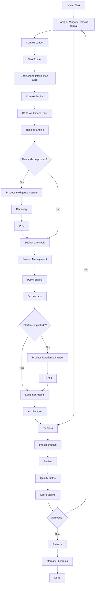

# Agent Orchestrator

## Objetivo

Definir como demandas devem ser encaminhadas entre Engineering Intelligence Core, brains, engines, meta-agentes, agentes especialistas, reviews, quality gates e documentação até a conclusão.

## Contexto

Os agentes especialistas resolvem partes do problema. O orquestrador define sequência, critérios de parada, escalonamento e responsabilidades para evitar lacunas entre negócio, produto, arquitetura, implementação, qualidade e conhecimento. O CEIP Runtime prepara a entrada operacional antes da orquestração: carrega contexto, classifica tarefa, aplica roteamento inicial e monta o prompt base.

Demandas de produto, feature, módulo, API, integração ou novo sistema devem passar pelo Product Intelligence System em `product-intelligence/` antes de Business Analyst, Product Manager, Policy Engine, Orchestrator, Architecture e Engineering. O PIS é responsável por discovery, PRD, requisitos, MVP, roadmap, features, stories e critérios de aceite.

Demandas que impactem tela, fluxo visual, dashboard, formulário, tabela, site, componente composto ou experiência responsiva devem passar pelo Product Experience System em `product-experience/` antes de UX, UI, Frontend, QA e release. O PXS é responsável por Experience Constitution, CloudSix Design Language, CDL Compliance, layout, interação, acessibilidade, Design Review, Product Experience Gate e Visual Quality Score.

Em projetos consumidores, o Orchestrator deve combinar CEIP Core e CEIP Workspace: o Core define as regras e o `.ceip/` fornece contexto local, stack, foco atual, riscos, memória, ADRs, RFCs e métricas.

Quando o Core estiver instalado como submodule, seu caminho recomendado é `.cloudsix/method`.

## Diretrizes

- Toda demanda de produto começa pelo Product Intelligence System quando envolver ideia, nova funcionalidade, novo módulo, API, integração ou mudança relevante de escopo.
- Toda demanda assistida por IA deve passar pelo CEIP Runtime, Context Loader, Task Router e Prompt Builder antes de execução.
- Toda demanda com interface impactada passa pelo Product Experience System depois da classificação do Policy Engine e antes de UX/UI/Frontend.
- Toda demanda funcional segue para Business Analysis e Product Management depois de Discovery e PRD.
- Toda demanda começa pelo Context Engine quando houver contexto insuficiente.
- Thinking Engine deve formular problema antes da solução.
- Policy Engine deve aplicar políticas antes do Orchestrator selecionar agentes, definir gates, aprovações e exceções.
- Orchestrator deve depender da classificação do Policy Engine para sequência, handoffs e bloqueios.
- Nenhuma arquitetura ou implementação deve ser encaminhada sem PRD, critérios de aceite e MVP quando a demanda exigir PIS, exceto por exceção registrada pelo Policy Engine.
- Nenhuma interface relevante deve ser encaminhada para frontend ou release sem critérios de experiência, CDL local, conformidade CDL, Product Experience Gate e Visual Quality Score, exceto por exceção registrada pelo Policy Engine.
- Em projeto consumidor, `.ceip/PROJECT.md`, `.ceip/STACK.md` e `.ceip/CONTEXT.md` devem ser consultados antes de selecionar agentes.
- Decisão estrutural passa pelo Chief Software Architect e por ADR.
- Quality Governor valida gates antes de concluir entrega relevante.
- Knowledge Curator atualiza base de conhecimento, ADRs, RFCs e padrões quando houver aprendizado.
- Nenhum agente deve pular leis do Constitution Engine.

## Fluxo oficial

## Meta-agentes

- Chief Engineering Officer: resolve conflitos estratégicos e aprova decisões de alto impacto.
- Technical Program Manager: coordena sequência, dependências, escopo e status.
- Quality Governor: valida quality gates, scorecards e bloqueios.
- Knowledge Curator: mantém conhecimento, ADRs, RFCs, patterns e anti-patterns.
- Engineering Intelligence Core: coordena Context, Thinking, Policy, Planning, Review, Quality, Memory e Learning.

## Exemplos

- Em um incidente crítico, o fluxo pode começar por DevOps Engineer e Security Engineer, mas deve retornar para pós-incidente, documentação e Knowledge Curator.
- Em uma nova integração, Product Intelligence define objetivo, PRD/RFC e critérios; Policy Engine classifica risco; Orchestrator aciona API Integration, Security, QA, DevOps e Documentation conforme impacto.
- Em novo produto, nova feature ou novo módulo, Product Intelligence System deve produzir PRD, MVP, roadmap e critérios de aceite antes de arquitetura.
- Em uma nova tela SaaS, Product Intelligence define requisito e critério; Policy Engine classifica risco; Orchestrator aciona Product Experience System, CDL local e CDL Compliance antes de UX, UI, Frontend e QA.
- Se houver regra repetitiva, Policy Brain deve criar ou atualizar política.
- Se houver decisão repetitiva, Decision Engine deve ser considerado.
- Se o projeto tiver `.ceip/`, decisões específicas devem ser registradas em `.ceip/adr/`, mudanças amplas em `.ceip/rfc/` e aprendizados em `.ceip/memory/`.

## Checklist

- [ ] A task tem objetivo e contexto.
- [ ] CEIP Runtime carregou contexto, rota e prompt base quando houve execução assistida por IA.
- [ ] Context e Thinking Engines foram aplicados quando necessário.
- [ ] Product Intelligence System foi aplicado quando a demanda envolveu produto, feature, módulo, API ou integração relevante.
- [ ] PRD, MVP, roadmap e critérios de aceite existem ou exceção formal foi registrada.
- [ ] Policy Engine classificou tarefa, risco, documentos, gates e aprovações antes do Orchestrator.
- [ ] Product Experience System foi aplicado quando houve interface, jornada visual, dashboard, tabela, formulário, site ou experiência responsiva.
- [ ] CloudSix Design Language local e conformidade CDL foram registradas quando aplicável.
- [ ] Product Experience Gate e Visual Quality Score foram definidos quando aplicáveis.
- [ ] Meta-agente coordenador foi definido.
- [ ] CEIP Workspace foi consultado quando existente.
- [ ] Agentes especialistas foram acionados por impacto.
- [ ] Reviews necessários foram executados.
- [ ] Quality gates foram validados.
- [ ] Conhecimento gerado foi registrado.
- [ ] Memory Engine e Learning Brain foram acionados quando houve aprendizado.
- [ ] Aprendizados locais foram registrados em `.ceip/`.

## Conclusão

O orquestrador transforma agentes isolados em um sistema coordenado de engenharia.
