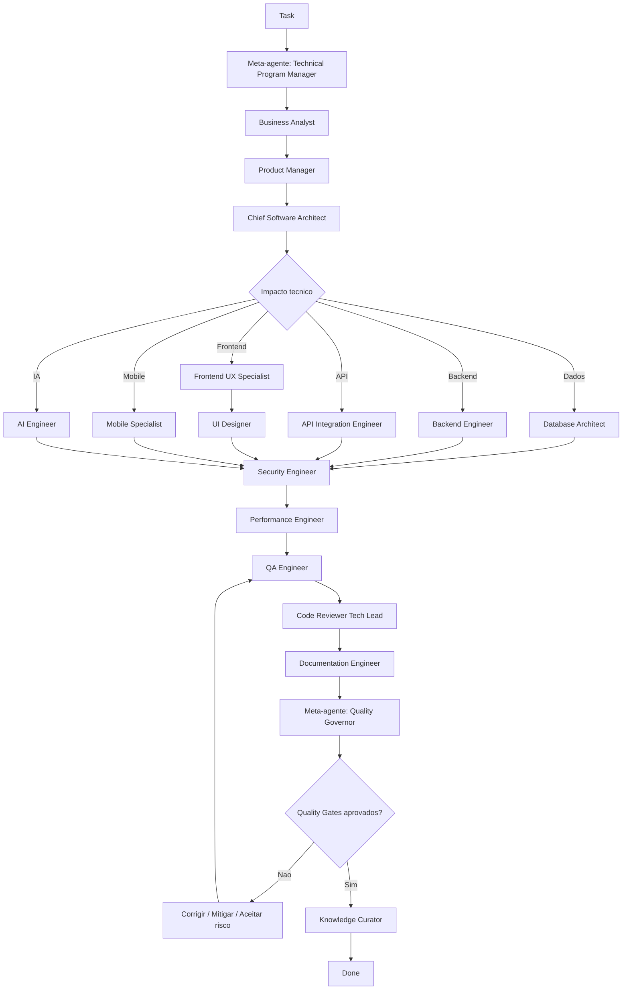

# Agent Orchestrator

## Objetivo

Definir como demandas devem ser encaminhadas entre meta-agentes, agentes especialistas, reviews, quality gates e documentação até a conclusão.

## Contexto

Os agentes especialistas resolvem partes do problema. O orquestrador define sequência, critérios de parada, escalonamento e responsabilidades para evitar lacunas entre negócio, produto, arquitetura, implementação, qualidade e conhecimento.

## Diretrizes

- Toda demanda começa por entendimento de negócio quando houver impacto funcional.
- Decisão estrutural passa pelo Chief Software Architect e por ADR.
- Quality Governor valida gates antes de concluir entrega relevante.
- Knowledge Curator atualiza base de conhecimento, ADRs, RFCs e padrões quando houver aprendizado.
- Nenhum agente deve pular leis do Constitution Engine.

## Fluxo oficial

## Meta-agentes

- Chief Engineering Officer: resolve conflitos estratégicos e aprova decisões de alto impacto.
- Technical Program Manager: coordena sequência, dependências, escopo e status.
- Quality Governor: valida quality gates, scorecards e bloqueios.
- Knowledge Curator: mantém conhecimento, ADRs, RFCs, patterns e anti-patterns.

## Exemplos

- Em um incidente crítico, o fluxo pode começar por DevOps Engineer e Security Engineer, mas deve retornar para pós-incidente, documentação e Knowledge Curator.
- Em uma nova integração, API Integration Engineer entra cedo, mas Security, QA, DevOps e Documentation precisam validar antes de concluir.

## Checklist

- [ ] A task tem objetivo e contexto.
- [ ] Meta-agente coordenador foi definido.
- [ ] Agentes especialistas foram acionados por impacto.
- [ ] Reviews necessários foram executados.
- [ ] Quality gates foram validados.
- [ ] Conhecimento gerado foi registrado.

## Conclusão

O orquestrador transforma agentes isolados em um sistema coordenado de engenharia.
