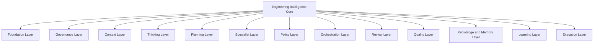

# CloudSix Engineering Intelligence Platform

## Objetivo

Definir o escopo estratégico da CloudSix Engineering Intelligence Platform, ou CEIP, como plataforma de inteligência de engenharia capaz de orientar pessoas, agentes de IA e ferramentas durante todo o ciclo de desenvolvimento de software.

## Contexto

Este projeto deixou de ser apenas um repositório de documentação. A documentação continua sendo uma camada essencial, mas não é o produto final. O produto é uma plataforma operacional de engenharia que coordena especialistas, aplica governança, preserva conhecimento, automatiza decisões repetitivas, aprende com projetos reais e evolui continuamente.

O nome CEIP descreve a capacidade da plataforma, não a tecnologia usada. A plataforma pode usar IA hoje, outra tecnologia amanhã, e continuar sendo uma plataforma de inteligência de engenharia.

## Diretrizes

- Pensar antes de implementar.
- Construir contexto antes de analisar.
- Governar decisões por políticas.
- Basear políticas na constituição da plataforma.
- Transformar regras repetitivas em políticas.
- Transformar oportunidades de decisão repetitiva em engines.
- Transformar conhecimento recorrente em memória reutilizável.
- Transformar limitações identificadas em novos módulos.
- Não depender exclusivamente da memória do modelo.
- Manter agnosticismo de tecnologia.

## Missão

Construir uma plataforma que seja capaz de atuar como uma software house completa composta por especialistas virtuais coordenados, com governança, memória, políticas, revisão, qualidade e aprendizado contínuo.

## Arquitetura conceitual

## Regras de autonomia

- Sempre que identificar limitação da plataforma, criar ou propor um módulo para resolvê-la.
- Sempre que existir oportunidade de automatizar uma decisão, criar ou propor um engine.
- Toda regra repetitiva deve virar política.
- Toda decisão arquitetural deve poder ser explicada pela plataforma.
- Todo conhecimento deve ser reutilizável.
- Nenhuma decisão deve depender exclusivamente da memória do modelo.

## Exemplos

- Se revisões sempre pedem a mesma verificação de segurança, essa verificação deve virar policy ou quality gate.
- Se agentes sempre precisam descobrir stack, essa descoberta deve ser tratada pelo Context Engine.
- Se decisões arquiteturais recorrentes aparecem em projetos, elas devem ser registradas no Knowledge Graph e relacionadas a ADRs.

## Checklist

- [ ] A decisão ou módulo contribui para inteligência de engenharia.
- [ ] O conteúdo não depende de tecnologia específica.
- [ ] A regra repetitiva foi convertida em política quando aplicável.
- [ ] A oportunidade de automação foi avaliada como engine.
- [ ] Conhecimento produzido é reutilizável.
- [ ] A plataforma consegue explicar a decisão tomada.

## Conclusão

CEIP é uma plataforma de inteligência para engenharia de software. Documentos são apenas uma interface; o núcleo é a capacidade de pensar, governar, aprender, coordenar e evoluir.
