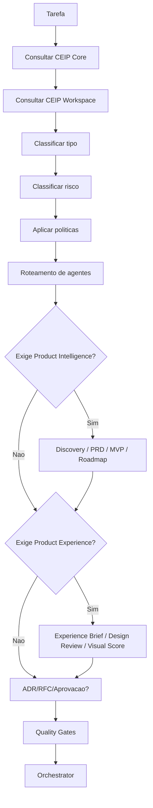

# Policy Engine da CEIP

## Objetivo

Definir o Policy Engine como mecanismo obrigatório de governança ativa da CloudSix Engineering Intelligence Platform.

## Contexto

Antes de uma tarefa relevante ser planejada ou executada, a CEIP deve classificar o tipo da tarefa, impacto, risco, agentes obrigatórios, documentos exigidos, quality gates, necessidade de ADR/RFC, aprovação humana, rollback e monitoramento pós-entrega.

Demandas de produto, feature, módulo, API, integração ou novo sistema devem ser classificadas também quanto à obrigatoriedade do Product Intelligence System. Quando aplicável, o Policy Engine deve exigir discovery, PRD, requisitos, MVP, roadmap, critérios de aceite e `quality-gates/product-intelligence-gate.md` antes de arquitetura ou implementação.

Demandas com interface, fluxo visual, dashboard, formulário, tabela, site, componente composto ou experiência responsiva devem ser classificadas quanto à obrigatoriedade do Product Experience System. Quando aplicável, o Policy Engine deve exigir experience brief, CloudSix Design Language local, CDL Compliance, Design Review, Visual Quality Score e `quality-gates/product-experience-gate.md` antes de UX/UI/Frontend, QA ou release.

Em projetos consumidores, o Policy Engine deve consultar o CEIP Core e o CEIP Workspace. O Core define as políticas; o `.ceip/` fornece contexto local para classificar risco com precisão.

Quando o Core estiver instalado como submodule, o caminho recomendado é `.cloudsix/method`. O Workspace local permanece em `.ceip/`.

## Diretrizes

- Toda tarefa relevante passa pelo Policy Engine antes do Orchestrator.
- Toda demanda de produto deve passar pelas `policy-engine/PRODUCT_INTELLIGENCE_POLICIES.md`.
- Toda demanda com interface relevante deve passar pelas `policy-engine/PRODUCT_EXPERIENCE_POLICIES.md`.
- Nenhum agente deve decidir sozinho quando há risco médio, alto ou crítico.
- Toda política deve ser agnóstica de tecnologia.
- Toda exceção deve registrar justificativa e risco residual.
- Toda regra repetitiva deve ser transformada em política.
- O `.ceip/` nunca substitui políticas globais do Core.

## Perguntas obrigatórias

1. Que tipo de tarefa é essa?
2. Qual é o impacto?
3. Qual é o risco?
4. Quais agentes são obrigatórios?
5. Quais agentes são opcionais?
6. Precisa de ADR?
7. Precisa de RFC?
8. Precisa de aprovação humana?
9. Quais Quality Gates são obrigatórios?
10. Quais checklists devem ser executados?
11. Quais documentos devem ser atualizados?
12. Pode implementar direto?
13. Precisa de planejamento formal?
14. Precisa de rollback?
15. Precisa de monitoramento pós-deploy?
16. Existe `.ceip/` com contexto local atualizado?
17. A decisão deve ser registrada em `.ceip/adr`, `.ceip/rfc`, `.ceip/tasks`, `.ceip/reviews` ou `.ceip/memory`?
18. A demanda exige Product Intelligence System antes de Business Analysis, Architecture ou Engineering?
19. Existe PRD, MVP, roadmap e critérios de aceite quando obrigatórios?
20. A demanda exige Product Experience System antes de UX/UI/Frontend ou release?
21. Existe Experience Brief, CDL local, CDL Compliance, Product Experience Gate e Visual Quality Score quando obrigatórios?

## Fluxo

## Exemplos

- Alteração de autenticação: risco alto ou crítico, exige Security Engineer, QA, Code Review, documentação, security gate e approval quando afetar produção.
- Novo produto ou feature relevante: exige Product Intelligence System, PRD, critérios de aceite, Product Intelligence Gate e roteamento para Business Analyst/Product Manager antes de arquitetura.
- Nova tela relevante: exige Product Experience System, CDL local, CDL Compliance, Product Experience Gate, Visual Quality Score e roteamento para Frontend UX Specialist, UI Designer e QA antes de release.
- Correção de texto: baixo risco, pode seguir com revisão simples e documentation gate quando aplicável.

## Checklist

- [ ] Tipo de tarefa foi classificado.
- [ ] Risco foi classificado.
- [ ] Agentes obrigatórios foram definidos.
- [ ] ADR/RFC foi avaliado.
- [ ] Product Intelligence System foi exigido ou dispensado com justificativa.
- [ ] Product Experience System, CDL local e conformidade CDL foram exigidos ou dispensados com justificativa.
- [ ] Quality Gates foram definidos.
- [ ] Aprovação, rollback e monitoramento foram avaliados.
- [ ] Workspace local foi consultado quando existente.
- [ ] Registro em `.ceip/` foi definido quando aplicável.

## Conclusão

O Policy Engine impede execução arbitrária e transforma governança em decisão operacional obrigatória.
