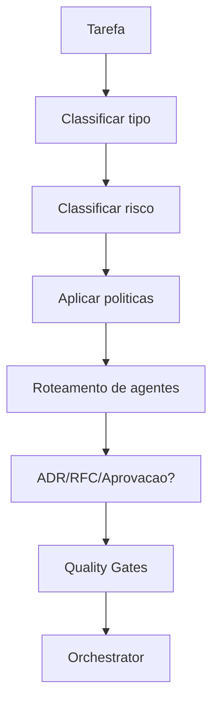

# Policy Engine da CEIP

## Objetivo

Definir o Policy Engine como mecanismo obrigatório de governança ativa da CloudSix Engineering Intelligence Platform.

## Contexto

Antes de uma tarefa relevante ser planejada ou executada, a CEIP deve classificar o tipo da tarefa, impacto, risco, agentes obrigatórios, documentos exigidos, quality gates, necessidade de ADR/RFC, aprovação humana, rollback e monitoramento pós-entrega.

## Diretrizes

- Toda tarefa relevante passa pelo Policy Engine antes do Orchestrator.
- Nenhum agente deve decidir sozinho quando há risco médio, alto ou crítico.
- Toda política deve ser agnóstica de tecnologia.
- Toda exceção deve registrar justificativa e risco residual.
- Toda regra repetitiva deve ser transformada em política.

## Perguntas obrigatórias

1. Que tipo de tarefa é essa?
2. Qual é o impacto?
3. Qual é o risco?
4. Quais agentes são obrigatórios?
5. Quais agentes são opcionais?
6. Precisa de ADR?
7. Precisa de RFC?
8. Precisa de aprovação humana?
9. Quais Quality Gates são obrigatórios?
10. Quais checklists devem ser executados?
11. Quais documentos devem ser atualizados?
12. Pode implementar direto?
13. Precisa de planejamento formal?
14. Precisa de rollback?
15. Precisa de monitoramento pós-deploy?

## Fluxo

## Exemplos

- Alteração de autenticação: risco alto ou crítico, exige Security Engineer, QA, Code Review, documentação, security gate e approval quando afetar produção.
- Correção de texto: baixo risco, pode seguir com revisão simples e documentation gate quando aplicável.

## Checklist

- [ ] Tipo de tarefa foi classificado.
- [ ] Risco foi classificado.
- [ ] Agentes obrigatórios foram definidos.
- [ ] ADR/RFC foi avaliado.
- [ ] Quality Gates foram definidos.
- [ ] Aprovação, rollback e monitoramento foram avaliados.

## Conclusão

O Policy Engine impede execução arbitrária e transforma governança em decisão operacional obrigatória.
