# CloudSix Engineering Framework

## Objetivo

Estabelecer um framework corporativo de engenharia de software para orientar agentes de IA, Codex, Claude Code, Gemini CLI, Cursor, Windsurf, GitHub Copilot e desenvolvedores humanos em projetos da CloudSix.

O framework define princípios, leis, papéis, padrões, fluxos, checklists, templates, decision trees, reviews, quality gates, scorecards, métricas e bibliotecas de conhecimento para criar, manter e evoluir software empresarial com qualidade técnica, previsibilidade e rastreabilidade.

## Contexto

A CloudSix atua em projetos como SaaS, ERP, CRM, sistemas administrativos, integrações, sites institucionais, automações com IA e modernização de sistemas legados. Esses contextos exigem decisões técnicas consistentes, mesmo quando a stack, o domínio e o grau de maturidade variam entre projetos.

Este repositório é 100% agnóstico de tecnologia. Nenhum documento assume linguagem, framework, banco de dados, provedor de nuvem, padrão de frontend, runtime, arquitetura ou ferramenta específica. Antes de propor implementação, qualquer agente ou pessoa deve identificar a stack existente, as restrições do projeto, o domínio de negócio e o risco operacional da alteração.

## Diretrizes

- Identificar a stack, arquitetura, convenções e restrições antes de propor mudanças.
- Não inventar funcionalidade, regra de negócio, requisito não declarado ou comportamento esperado.
- Justificar toda decisão técnica relevante com contexto, alternativas e trade-offs.
- Registrar decisões arquiteturais importantes em ADR.
- Preferir evolução incremental, observável e reversível em vez de reescritas amplas.
- Considerar segurança, performance, testes, manutenção e experiência do usuário em toda alteração.
- Tratar documentação como produto de engenharia, não como tarefa acessória.
- Usar `constitution/` como fonte normativa operacional.
- Usar `ORCHESTRATOR.md` para coordenar agentes, meta-agentes e quality gates.
- Manter linguagem técnica, objetiva e em português do Brasil.

## Mapa do repositório

```mermaid
flowchart TD
    A["README.md"] --> B["Documentos de governança"]
    A --> K["INDEX.md / ROADMAP.md / AI_USAGE_GUIDE.md"]
    A --> C["docs/agents"]
    A --> D["docs/standards"]
    A --> E["docs/playbooks"]
    A --> F["docs/templates"]
    A --> G["docs/checklists"]
    A --> H["docs/workflows"]
    A --> I["docs/adr"]
    A --> J["docs/examples"]
    A --> L["docs/reference-architectures"]
    A --> M["docs/prompts"]
    A --> N["docs/architecture"]
    A --> O["docs/glossary"]
    A --> P["constitution"]
    A --> Q["ORCHESTRATOR.md / meta-agents"]
    A --> R["quality-gates / review / score-system"]
    A --> S["knowledge / patterns / anti-patterns / recipes"]
    A --> T["decision-trees / prompts / metrics"]
    A --> U["NEXT_STEPS.md / validation / specialist-reviews / audits / pilots / cli"]
    B --> B1["CONSTITUTION.md"]
    B --> B2["ENGINEERING_PRINCIPLES.md"]
    B --> B3["DECISION_FRAMEWORK.md"]
    C --> C1["Agentes especialistas"]
    D --> D1["Padrões técnicos agnósticos"]
    E --> E1["Procedimentos operacionais"]
```

## Como usar

1. Leia `CONSTITUTION.md` para entender as regras fundamentais.
2. Consulte `constitution/` para leis operacionais por domínio.
3. Use `INDEX.md` para navegar por assunto.
4. Leia `NEXT_STEPS.md` para entender o ciclo de maturidade atual.
5. Leia `ORCHESTRATOR.md` para escolher meta-agentes, agentes e ordem de execução.
6. Leia `AGENTS.md` para responsabilidades dos agentes especialistas.
7. Leia `AI_USAGE_GUIDE.md` para usar o framework com Codex, Claude Code, Gemini CLI, Cursor, Windsurf, GitHub Copilot e outras IAs.
8. Leia `CODEX.md` quando o executor for o Codex.
9. Use `DECISION_FRAMEWORK.md` e `decision-trees/` antes de decisões técnicas relevantes.
10. Aplique os padrões em `docs/standards`.
11. Execute os playbooks em `docs/playbooks` ou receitas em `recipes/`.
12. Consulte arquiteturas de referência em `docs/reference-architectures`.
13. Acione agentes com prompts de `docs/prompts` ou tarefas com `prompts/`.
14. Registre decisões em `adr/` e consulte ADRs fundacionais em `docs/adr`.
15. Use `review/`, `quality-gates/` e `score-system/` para validar entregas.
16. Use `validation/`, `specialist-reviews/` e `audits/` para auditar o próprio framework.
17. Consulte `pilots/` para validação em projeto real e `cli/` para o futuro CLI.
18. Consulte `knowledge/`, `patterns/`, `anti-patterns/` e `metrics/` para aprendizado contínuo.

## Exemplos

- Em um ERP legado, comece por `docs/playbooks/02-sistema-legado.md`, acione Business Analyst, Chief Software Architect, Database Architect, QA Engineer e Refactoring Specialist.
- Em uma feature SaaS, use `docs/workflows/01-feature-development.md`, `docs/templates/technical-spec-template.md` e `docs/checklists/code-review-checklist.md`.
- Em uma integração, use `docs/playbooks/07-integracao-api.md` e os padrões de API, segurança, observabilidade e testes.
- Em uma entrega crítica, use `ORCHESTRATOR.md`, valide `quality-gates/`, registre scorecard em `score-system/scorecard-template.md` e atualize `knowledge/` se houver aprendizado.
- Para amadurecer o framework, siga `NEXT_STEPS.md`, rode `validation/`, registre em `audits/` e execute as rodadas em `specialist-reviews/`.

## Checklist

- [ ] A stack existente foi identificada antes de qualquer recomendação.
- [ ] O problema de negócio foi descrito sem suposições indevidas.
- [ ] A decisão proposta tem alternativas e justificativa.
- [ ] Riscos de segurança, performance, testes e manutenção foram avaliados.
- [ ] Mudanças arquiteturais relevantes geraram ADR.
- [ ] A documentação foi atualizada junto com a entrega.
- [ ] Quality gates e reviews aplicáveis foram executados.
- [ ] Aprendizados relevantes foram registrados na Knowledge Base.
- [ ] Próximos passos e validações do framework foram consultados quando o trabalho afetou o framework.

## Conclusão

Este framework deve ser usado como contrato operacional da engenharia CloudSix. Ele não substitui análise técnica nem conhecimento do domínio, mas cria uma base comum para decisões melhores, execução consistente e colaboração segura entre pessoas e agentes de IA.
