# CloudSix Engineering Intelligence Platform

## Objetivo

Estabelecer a CloudSix Engineering Intelligence Platform (CEIP), uma plataforma corporativa de inteligência de engenharia de software para orientar agentes de IA, Codex, Claude Code, Gemini CLI, Cursor, Windsurf, GitHub Copilot e desenvolvedores humanos em projetos da CloudSix.

A CEIP define princípios, leis, brains, engines, papéis, padrões, fluxos, checklists, templates, decision trees, reviews, quality gates, scorecards, métricas e bibliotecas de conhecimento para criar, manter e evoluir software empresarial com qualidade técnica, previsibilidade e rastreabilidade.

A arquitetura oficial é **Core + Workspace**: este repositório é o CEIP Core, enquanto cada projeto consumidor mantém seu contexto local em `.ceip/`.

## Contexto

A CloudSix atua em projetos como SaaS, ERP, CRM, sistemas administrativos, integrações, sites institucionais, automações com IA e modernização de sistemas legados. Esses contextos exigem decisões técnicas consistentes, mesmo quando a stack, o domínio e o grau de maturidade variam entre projetos.

Este repositório é 100% agnóstico de tecnologia. Nenhum documento assume linguagem, framework, banco de dados, provedor de nuvem, padrão de frontend, runtime, arquitetura ou ferramenta específica. Antes de propor implementação, qualquer agente ou pessoa deve identificar a stack existente, as restrições do projeto, o domínio de negócio e o risco operacional da alteração.

## Diretrizes

- Identificar a stack, arquitetura, convenções e restrições antes de propor mudanças.
- Não inventar funcionalidade, regra de negócio, requisito não declarado ou comportamento esperado.
- Justificar toda decisão técnica relevante com contexto, alternativas e trade-offs.
- Registrar decisões arquiteturais importantes em ADR.
- Preferir evolução incremental, observável e reversível em vez de reescritas amplas.
- Considerar segurança, performance, testes, manutenção e experiência do usuário em toda alteração.
- Tratar documentação como produto de engenharia, não como tarefa acessória.
- Tratar a CEIP como produto versionado, com changelog, processo de release, governança e RFC para mudanças estruturais.
- Usar `PLATFORM.md` para entender a missão estratégica da CEIP.
- Usar `CHANGELOG.md`, `VERSIONING.md` e `RELEASE_PROCESS.md` antes de publicar nova versão.
- Usar `GOVERNANCE.md`, `RFC_PROCESS.md` e `CONTRIBUTING.md` para evoluir a plataforma sem perder coerência.
- Usar `MANUAL_DE_USO.md` para integrar a CEIP em projetos consumidores via Git submodule.
- Usar `workspace/` para entender a arquitetura Core + Workspace e inicializar `.ceip/`.
- Usar o CEIP Installer com `node bin/ceip.js init` ou `ceip init` para configurar projetos consumidores.
- Usar `runtime/` para carregar contexto, rotear tarefas, montar prompts e registrar execução assistida por IA.
- Usar `product-intelligence/` como porta de entrada para ideias, produtos, funcionalidades, módulos, APIs e integrações antes de Business Analysis, Architecture ou Engineering.
- Usar `product-experience/` para definir experiência premium, linguagem visual, layout, interação, acessibilidade e Visual Quality Score antes de UX/UI/Frontend quando houver interface impactada.
- Usar `brains/` e `engines/` como núcleo operacional de raciocínio, decisão, qualidade, score e evolução.
- Usar `policy-engine/` para roteamento, risco, rules, examples, gates e aprovações.
- Usar `constitution/` como fonte normativa operacional.
- Usar `ORCHESTRATOR.md` e `orchestrator/` para coordenar agentes, handoffs, meta-agentes e quality gates.
- Usar `memory/` e `knowledge/` para registrar aprendizado sem dados sensíveis desnecessários.
- Nunca duplicar o CEIP Core dentro de `.ceip/`; o workspace guarda somente contexto do projeto.
- Manter linguagem técnica, objetiva e em português do Brasil.

## Mapa do repositório

```mermaid
flowchart TD
    A["README.md"] --> B["Documentos de governança"]
    A --> K["INDEX.md / ROADMAP.md / CHANGELOG.md / VERSIONING.md / RELEASE_PROCESS.md"]
    A --> K2["GOVERNANCE.md / RFC_PROCESS.md / CONTRIBUTING.md / MANUAL_DE_USO.md / AI_USAGE_GUIDE.md"]
    A --> C["docs/agents"]
    A --> D["docs/standards"]
    A --> E["docs/playbooks"]
    A --> F["docs/templates"]
    A --> G["docs/checklists"]
    A --> H["docs/workflows"]
    A --> I["docs/adr"]
    A --> J["docs/examples"]
    A --> L["docs/reference-architectures"]
    A --> M["docs/prompts"]
    A --> N["docs/architecture"]
    A --> O["docs/glossary"]
    A --> P["constitution"]
    A --> Q["ORCHESTRATOR.md / meta-agents"]
    A --> R["quality-gates / review / score-system"]
    A --> S["knowledge / patterns / anti-patterns / recipes"]
    A --> T["decision-framework / decision-trees / prompts / metrics"]
    A --> U["NEXT_STEPS.md / validation / specialist-reviews / audits / pilots / cli"]
    A --> V["PLATFORM.md / brains / engines / policy-engine / memory / knowledge / knowledge-graph / lifecycle"]
    A --> W["orchestrator / agents / governance / diagrams / examples"]
    A --> X["workspace / templates / examples"]
    A --> Y["product-intelligence / PIS"]
    A --> Z["product-experience / PXS / CDL"]
    A --> AA["runtime / Context Loader / Prompt Builder"]
    B --> B1["CONSTITUTION.md"]
    B --> B2["ENGINEERING_PRINCIPLES.md"]
    B --> B3["DECISION_FRAMEWORK.md"]
    C --> C1["Agentes especialistas"]
    D --> D1["Padrões técnicos agnósticos"]
    E --> E1["Procedimentos operacionais"]
```

## Como usar

1. Leia `CONSTITUTION.md` para entender as regras fundamentais.
2. Leia `MANUAL_DE_USO.md` para integrar a CEIP em projetos consumidores.
3. Leia `workspace/README.md` para entender CEIP Core + `.ceip/`.
4. Leia `PLATFORM.md` para entender a CEIP como plataforma de inteligência de engenharia.
5. Consulte `constitution/` para leis operacionais por domínio.
6. Consulte `runtime/` antes de executar tarefas relevantes com IA.
7. Consulte `product-intelligence/` antes de iniciar novo produto, feature, módulo, API ou integração relevante.
8. Consulte `product-experience/` e `product-experience/CLOUDSIX_DESIGN_LANGUAGE.md` quando a demanda envolver tela, fluxo visual, dashboard, formulário, tabela, site ou experiência responsiva.
9. Consulte `brains/`, `engines/`, `layers/`, `policy-engine/` e `knowledge-graph/` para entender o funcionamento interno.
10. Use `INDEX.md` para navegar por assunto.
11. Leia `CHANGELOG.md`, `VERSIONING.md` e `RELEASE_PROCESS.md` antes de preparar release.
12. Leia `GOVERNANCE.md`, `RFC_PROCESS.md` e `CONTRIBUTING.md` antes de propor mudança estrutural.
13. Leia `NEXT_STEPS.md` para entender o ciclo de maturidade atual.
14. Leia `ORCHESTRATOR.md` e `orchestrator/` para escolher meta-agentes, agentes, handoffs e ordem de execução.
15. Leia `AGENTS.md`, `agents/` e `docs/agents/` para responsabilidades dos agentes especialistas.
16. Leia `AI_USAGE_GUIDE.md` para usar a CEIP com Codex, Claude Code, Gemini CLI, Cursor, Windsurf, GitHub Copilot e outras IAs.
17. Leia `CODEX.md` quando o executor for o Codex.
18. Use `DECISION_FRAMEWORK.md`, `decision-framework/` e `decision-trees/` antes de decisões técnicas relevantes.
19. Aplique os padrões em `docs/standards`.
20. Execute os playbooks em `docs/playbooks` ou receitas em `recipes/`.
21. Consulte arquiteturas de referência em `docs/reference-architectures`.
22. Acione agentes com prompts de `prompts/agents`, `docs/prompts` ou prompts de tarefa em `prompts/`.
23. Registre decisões em `adr/` e consulte ADRs fundacionais em `docs/adr`.
24. Use `review/`, `quality-gates/`, `metrics/` e `score-system/` para validar entregas.
25. Use `validation/`, `specialist-reviews/` e `audits/` para auditar a própria plataforma.
26. Consulte `docs/playbooks/projeto-piloto.md`, `pilots/` e `validation/pilot-project-validation.md` para validação em projeto real.
27. Consulte `memory/`, `knowledge/`, `patterns/`, `anti-patterns/` e `recipes/` para aprendizado contínuo.

## Fluxo Oficial

```mermaid
flowchart LR
    A["Ideia / Task"] --> A1["CEIP Runtime"]
    A1 --> A2["Context Loader"]
    A2 --> A3["Task Router"]
    A3 --> B["Product Intelligence System"]
    B --> C["Discovery"]
    C --> D["PRD"]
    D --> E["Business Analysis"]
    E --> F["Product Management"]
    F --> G["Policy Engine"]
    G --> H["Orchestrator"]
    H --> I{"Interface impactada?"}
    I -->|Sim| J["Product Experience System / CDL"]
    J --> K["UX / UI"]
    I -->|Nao| L["Specialist Agents"]
    K --> L
    L --> M["Architecture"]
    M --> N["Planning"]
    N --> O["Implementation"]
    O --> P["Review"]
    P --> Q["Quality Gates"]
    Q --> R["Score"]
    R --> S["Release"]
    S --> T["Memory / Learning"]
```

## Exemplos

- Em um ERP legado, comece por `docs/playbooks/02-sistema-legado.md`, acione Business Analyst, Chief Software Architect, Database Architect, QA Engineer e Refactoring Specialist.
- Para transformar uma ideia em produto, comece por `product-intelligence/README.md`, execute `product-intelligence/playbooks/novo-produto.md` e gere PRD, MVP, roadmap e backlog antes de arquitetura.
- Para uma tela, dashboard, tabela ou formulário relevante, consulte `product-experience/README.md`, aplique `product-experience/CLOUDSIX_DESIGN_LANGUAGE.md`, registre conformidade com `product-experience/CDL_COMPLIANCE.md`, calcule `product-experience/VISUAL_QUALITY_SCORE.md` e valide `quality-gates/product-experience-gate.md`.
- Para adotar a CEIP em outro projeto, siga `MANUAL_DE_USO.md`, adicione o Core como submodule em `.cloudsix/method` e crie o Workspace local `.ceip/`.
- Para execução assistida por IA, use `ceip analyze`, `ceip plan`, `ceip architect`, `ceip review`, `ceip release` ou `ceip learn` para gerar Runtime Packs.
- Para instalação guiada, use `docs/playbooks/ceip-installer.md` e execute `node bin/ceip.js init`; o installer v0.9.0-rc.2 cria estruturas locais de Runtime, Product Intelligence, Product Experience e CloudSix Design Language no Workspace.
- Para evoluir a CEIP, consulte `GOVERNANCE.md`, abra RFC quando necessário em `RFC_PROCESS.md`, atualize `CHANGELOG.md` e siga `RELEASE_PROCESS.md`.
- Em uma feature SaaS, use `docs/workflows/01-feature-development.md`, `docs/templates/technical-spec-template.md` e `docs/checklists/code-review-checklist.md`.
- Em uma integração, use `docs/playbooks/07-integracao-api.md` e os padrões de API, segurança, observabilidade e testes.
- Em uma entrega crítica, use `ORCHESTRATOR.md`, valide `quality-gates/`, registre scorecard em `score-system/scorecard-template.md` e atualize `knowledge/` se houver aprendizado.
- Para amadurecer o framework, siga `NEXT_STEPS.md`, rode `validation/`, registre em `audits/` e execute as rodadas em `specialist-reviews/`.
- Para evoluir a plataforma, use `PLATFORM.md`, `intelligence-core/README.md`, `engines/README.md` e `lifecycle/README.md`.
- Para exemplos práticos, use `examples/01-policy-routing-example.md`, `examples/02-quality-score-example.md` e `examples/03-pilot-scope-example.md`.
- Para explicar fluxos, use `diagrams/ceip-operational-flow.md`, `diagrams/policy-orchestration-flow.md` e `diagrams/score-approval-flow.md`.

## Checklist

- [ ] A stack existente foi identificada antes de qualquer recomendação.
- [ ] Runtime, Context Loader e Prompt Builder foram aplicados quando houve execução assistida por IA.
- [ ] Demandas de produto passaram pelo Product Intelligence System antes de arquitetura ou implementação.
- [ ] Interfaces relevantes passaram pelo Product Experience System, CDL local e conformidade CDL antes de UX/UI/Frontend ou release.
- [ ] O problema de negócio foi descrito sem suposições indevidas.
- [ ] A decisão passou pelo contexto, thinking, policy e decision engine quando aplicável.
- [ ] A decisão proposta tem alternativas e justificativa.
- [ ] Riscos de segurança, performance, testes e manutenção foram avaliados.
- [ ] Mudanças arquiteturais relevantes geraram ADR.
- [ ] A documentação foi atualizada junto com a entrega.
- [ ] Quality gates e reviews aplicáveis foram executados.
- [ ] Visual Quality Score foi calculado quando houve interface impactada.
- [ ] Aprendizados relevantes foram registrados na Knowledge Base.
- [ ] Próximos passos e validações do framework foram consultados quando o trabalho afetou o framework.
- [ ] Mudanças estruturais da CEIP passaram por governança, RFC e processo de release quando aplicável.

## Conclusão

A CEIP deve ser usada como sistema operacional de engenharia da CloudSix. Ela não substitui análise técnica nem conhecimento do domínio, mas cria inteligência reutilizável para decisões melhores, execução consistente e colaboração segura entre pessoas e agentes de IA.

## Direitos autorais

© 2026 CloudSix Sistemas e Tecnologia Ltda. Todos os direitos reservados.

Este repositório é público para consulta e integração autorizada, mas não concede licença aberta de uso, cópia, modificação, redistribuição ou exploração comercial. Consulte `LICENSE.md`.
