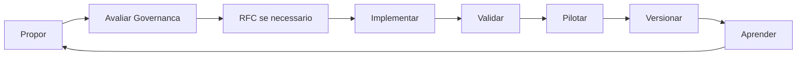

# Roadmap da CloudSix Engineering Intelligence Platform

## Objetivo

Definir a evolução planejada da CEIP por versões, mantendo clareza sobre fundação, agents, brains, engines, policies, playbooks, templates, checklists, arquiteturas de referência e módulos de governança operacional.

## Contexto

Uma plataforma de engenharia precisa evoluir com uso real. O roadmap organiza incrementos sem transformar a CEIP em um projeto fechado, dependente de tecnologia específica ou complexo demais para adoção.

## Status Atual

**v0.9.0-rc.2 - Release Candidate 2**

CEIP está em Release Candidate de produto, com Core + Workspace, Runtime, Context Loader, Prompt Builder, Product Intelligence, Product Experience, CDL, Installer, Doctor, Validation Suite, CLI operacional inicial e disciplina formal de governança, versionamento, contribuição, RFC e release.

## Versões planejadas

| Versão | Nome | Escopo |
| --- | --- | --- |
| v0.9 RC-1 | Runtime Foundation | Runtime, Context Loader, Task Router, Prompt Builder, Runtime API, comandos CLI e auditoria executiva |
| v0.9 RC-2 | Product Governance | Changelog, versionamento, processo de release, contribuição, governança, RFC pública e critérios de promoção para v1.0 |
| v0.9 RC-3 | Pilot Hardening | Teste em projeto real, ajustes de DX/AIX, redução de carga cognitiva, correções de onboarding e evidências de uso |
| v1.0 | Production Baseline | Plataforma aprovada para adoção oficial, com installer, doctor, runtime, gates e relatórios estabilizados |
| v1.1 | Profiles | CEIP Profiles, Team Profiles e Maturity Levels aplicados no Installer |
| v1.2 | Domain Packs | Packs para ERP, CRM, SaaS, marketplace, oficina, construção, frotas, saúde e educação |
| v1.3 | Capability Packs | Packs para autenticação, pagamentos, relatórios, dashboards, notificações, busca, analytics, billing e multi-tenancy |
| v1.4 | Engineering Marketplace | Plugins opcionais de quality, security, performance, UX e documentação |
| v1.5 | CEIP Upgrade | Comando `ceip upgrade` para migrar Workspaces antigos para versões novas |
| v1.6 | CEIP Audit | Comando `ceip audit` com validações estruturais, links, runtime, gates e score |
| v2.0 | Engineering OS | Evolução contínua com CEIP Evolution, aprendizado recorrente e automação governada |

## Critérios para v1.0.0

A CEIP só deve ser promovida para `v1.0.0` quando:

- O Installer estiver validado em pelo menos um projeto real.
- Runtime, Context Loader e Prompt Builder tiverem evidências de uso prático.
- `ceip doctor` validar um Workspace completo criado pelo Installer.
- O projeto piloto estiver documentado em `pilots/`.
- `CHANGELOG.md`, `VERSIONING.md`, `RELEASE_PROCESS.md`, `GOVERNANCE.md` e `RFC_PROCESS.md` estiverem atualizados.
- A Validation Suite não apontar lacuna crítica.
- Não houver recomendação de stack fixa no Core.
- Dívidas técnicas bloqueantes estiverem resolvidas ou registradas em `review/technical-debt-method.md`.
- O Review Board aprovar a promoção.

## Critérios de evolução

- Toda nova versão deve preservar o caráter agnóstico de tecnologia.
- Mudanças estruturais devem atualizar `INDEX.md`, `README.md` e documentos relacionados.
- Novos padrões devem incluir objetivo, contexto, diretrizes, exemplos, checklist e conclusão.
- Novas decisões estruturais devem gerar ADR.
- Conteúdo adicionado deve ser útil em software empresarial real, não apenas descritivo.
- Novos módulos operacionais devem se conectar a `ORCHESTRATOR.md`, `orchestrator/`, `INDEX.md`, quality gates e constitution.
- Novos módulos dinâmicos devem se conectar a `runtime/`, `policy-engine/RUNTIME_POLICIES.md`, `ceip doctor` e Workspace.
- Novos módulos estratégicos devem declarar brain, engine, policy, memory ou relação no Knowledge Graph.
- Novos módulos de produto devem conectar `product-intelligence/`, Policy Engine, Product Intelligence Gate, AGENTS e Orchestrator.
- Novos módulos de experiência devem conectar `product-experience/`, Product Experience Gate, Visual Quality Score, UX/UI agents, AGENTS e Orchestrator.
- Toda versão a partir da v1.3 deve considerar `policy-engine/`, `review/`, `validation/` e `metrics/`.
- Evoluções de Workspace devem preservar a separação entre Core global e `.ceip/` local.
- A arquitetura Core + Workspace deve manter `.cloudsix/method` como caminho recomendado para submodule e `.ceip/` como estado local do projeto.
- Evoluções de Runtime devem priorizar segurança de contexto, baixa carga cognitiva e prompts proporcionais ao risco.
- A CEIP deve crescer verticalmente antes de crescer horizontalmente.
- Para cada novo módulo estrutural, pelo menos cinco ativos existentes relacionados devem ser revisados ou melhorados.
- Funcionalidades sem prova de valor devem começar como plugin, Domain Pack, Capability Pack, RFC experimental ou artefato de Workspace antes de entrar no Core.
- Toda release deve atualizar `CHANGELOG.md` e seguir `RELEASE_PROCESS.md`.
- Toda mudança estrutural deve respeitar `GOVERNANCE.md` e `RFC_PROCESS.md`.

## Modelo de branches

| Branch | Função |
| --- | --- |
| `main` | Linha publicada e pronta para consumo |
| `develop` | Integração da próxima versão |
| `feature/*` | Trabalho isolado em melhoria específica |
| `release/*` | Estabilização de release candidate |
| `hotfix/*` | Correção urgente a partir de `main` |

Tags oficiais devem seguir `VERSIONING.md`. A tag `v1.0.0` só deve ser criada quando os critérios de produção estiverem cumpridos.

## Ciclo recomendado

## Exemplos

- Ao adicionar um novo tipo de arquitetura de referência, criar documento em `docs/reference-architectures`, atualizar `INDEX.md` e avaliar se um ADR é necessário.
- Ao ajustar um agente, atualizar também o prompt equivalente em `docs/prompts`.
- Ao criar novo playbook, adicionar checklist mínimo ou referenciar checklist existente.
- Ao adicionar nova recipe, relacionar agentes, gates e validações.
- Ao identificar aprendizado recorrente, registrar em `knowledge` e avaliar se deve virar standard.
- Ao mudar a estrutura do framework, atualizar `validation/` e registrar achado em `audits/` quando aplicável.
- Ao validar em projeto real, registrar resultado em `pilots/`.
- Ao identificar decisão repetitiva, criar ou atualizar engine.
- Ao identificar regra repetitiva, criar ou atualizar policy.
- Ao identificar ideia, produto ou funcionalidade relevante, iniciar por `product-intelligence/` antes de arquitetura.
- Ao identificar interface, fluxo visual ou frontend relevante, iniciar por `product-experience/` antes de UX/UI/Frontend.
- Ao identificar execução assistida por IA, iniciar por `runtime/` e gerar Runtime Pack quando houver Workspace.
- Ao preparar release, atualizar `CHANGELOG.md`, aplicar `VERSIONING.md` e seguir `RELEASE_PROCESS.md`.
- Ao propor mudança estrutural, usar `RFC_PROCESS.md` antes de implementar.
- Ao identificar conteúdo sem função operacional, condensar, remover ou manter fora do Core.

## Checklist

- [ ] A versão tem escopo claro.
- [ ] A mudança mantém agnosticismo tecnológico.
- [ ] Documentos de navegação foram atualizados.
- [ ] Há exemplo prático quando aplicável.
- [ ] Há checklist operacional.
- [ ] Decisões estruturais foram registradas.
- [ ] Módulos operacionais foram conectados ao índice e ao orquestrador.
- [ ] Módulos dinâmicos foram conectados ao Runtime e ao Doctor.
- [ ] Suíte de validação e rodadas especializadas foram atualizadas.
- [ ] Módulos novos foram conectados ao Engineering Intelligence Core.
- [ ] Demandas de produto foram conectadas ao Product Intelligence System.
- [ ] Demandas de experiência foram conectadas ao Product Experience System.
- [ ] Changelog, versionamento e processo de release foram atualizados quando necessário.
- [ ] RFC foi criada quando a mudança alterou fluxo, Core, Runtime, Installer ou Workspace.
- [ ] A mudança melhora a plataforma sem expandir complexidade sem ganho claro.

## Conclusão

O roadmap orienta evolução contínua sem perder coerência. A CEIP deve amadurecer como produto a partir de uso real, auditorias recorrentes, releases versionadas e decisões documentadas.
