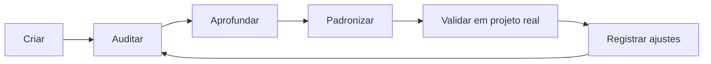

# Roadmap da CloudSix Engineering Intelligence Platform

## Objetivo

Definir a evolução planejada da CEIP por versões, mantendo clareza sobre fundação, agents, brains, engines, policies, playbooks, templates, checklists, arquiteturas de referência e módulos de governança operacional.

## Contexto

Um framework de engenharia precisa evoluir com uso real. O roadmap organiza incrementos sem transformar a documentação em um projeto fechado ou dependente de uma tecnologia específica.

## Versões planejadas

| Versão | Nome | Escopo |
| --- | --- | --- |
| v1.0 | Fundação | Documentos-raiz, constituição, manifesto, princípios, decisão, qualidade, índice e guia de uso com IA |
| v1.1 | Agentes Especialistas | Perfis dos 18 agentes, prompts individuais, limites, entradas, saídas e fluxo oficial |
| v1.2 | Engineering OS | Orchestrator, workflows, playbooks, templates, ADR, RFC e rotinas operacionais |
| v1.3 | Policy Engine | Policies, rules, examples, roteamento por tarefa, classificação de risco e aprovação |
| v1.4 | Brains e Engines | Engineering Intelligence Core, brains especializados e engines operacionais |
| v1.5 | Quality Gates e Score Engine | Gates por domínio, métricas 0-100, mínimos por risco e decisão de aprovação |
| v1.6 | Memory e Knowledge Layer | Memory Layer, Knowledge Base, Knowledge Graph e regras de privacidade |
| v1.7 | Patterns, Anti-patterns e Recipes | Catálogos de solução, erros recorrentes e receitas operacionais |
| v1.8 | Validation Suite | Validações de plataforma, arquitetura, documentação, agentes, policies, gates, brains e engines |
| v1.9 | Projeto Piloto | Validação controlada em projeto real, com GSA Oficina como candidato recomendado |
| v2.0 | CloudSix Engineering Intelligence Platform Consolidada | Plataforma integrada, auditada, versionada e pronta para adoção controlada |
| v2.1 | CEIP Core + Workspace Architecture | Separação formal entre Core global e Workspace local `.ceip/` |
| v2.2 | Workspace Templates | Templates oficiais para inicialização e manutenção de `.ceip/` |
| v2.3 | Workspace Validation Suite | Validação de integração Core + Workspace em projetos consumidores |
| v2.4 | CLI ceip init/analyze/review/score | Evolução futura para comandos de inicialização, análise, revisão e score |
| v2.5 | Workspace Automation | Automação futura de atualização, validação e geração de artefatos locais |
| v2.6 | Product Intelligence System | Camada de descoberta, PRD, requisitos, MVP, roadmap, backlog e Product Pipeline antes da engenharia |
| v2.7 | CEIP Installer alinhado ao PIS | Installer v0.2.0 com Product Intelligence local, `project.json` atualizado e `doctor` validando PIS |
| v2.8 | Auditoria geral do Method | Auditoria estrutural, conceitual, operacional, agnóstica, agentes, brains, engines, PIS, policies, workspace, installer e segurança |
| v2.9 | Business Operating System | Evolução futura para visão, estratégia, posicionamento, monetização, pricing, ROI e risco de mercado |

## Critérios de evolução

- Toda nova versão deve preservar o caráter agnóstico de tecnologia.
- Mudanças estruturais devem atualizar `INDEX.md`, `README.md` e documentos relacionados.
- Novos padrões devem incluir objetivo, contexto, diretrizes, exemplos, checklist e conclusão.
- Novas decisões estruturais devem gerar ADR.
- Conteúdo adicionado deve ser útil em software empresarial real, não apenas descritivo.
- Novos módulos operacionais devem se conectar a `ORCHESTRATOR.md`, `orchestrator/`, `INDEX.md`, quality gates e constitution.
- Novos módulos estratégicos devem declarar brain, engine, policy, memory ou relação no Knowledge Graph.
- Novos módulos de produto devem conectar `product-intelligence/`, Policy Engine, Product Intelligence Gate, AGENTS e Orchestrator.
- Toda versão a partir da v1.3 deve considerar `policy-engine/`, `review/`, `validation/` e `metrics/`.
- Evoluções de Workspace devem preservar a separação entre Core global e `.ceip/` local.
- A arquitetura Core + Workspace deve manter `.cloudsix/method` como caminho recomendado para submodule e `.ceip/` como estado local do projeto.

## Ciclo recomendado

## Exemplos

- Ao adicionar um novo tipo de arquitetura de referência, criar documento em `docs/reference-architectures`, atualizar `INDEX.md` e avaliar se um ADR é necessário.
- Ao ajustar um agente, atualizar também o prompt equivalente em `docs/prompts`.
- Ao criar novo playbook, adicionar checklist mínimo ou referenciar checklist existente.
- Ao adicionar nova recipe, relacionar agentes, gates e validações.
- Ao identificar aprendizado recorrente, registrar em `knowledge` e avaliar se deve virar standard.
- Ao mudar a estrutura do framework, atualizar `validation/` e registrar achado em `audits/` quando aplicável.
- Ao validar em projeto real, registrar resultado em `pilots/`.
- Ao identificar decisão repetitiva, criar ou atualizar engine.
- Ao identificar regra repetitiva, criar ou atualizar policy.
- Ao identificar ideia, produto ou funcionalidade relevante, iniciar por `product-intelligence/` antes de arquitetura.

## Checklist

- [ ] A versão tem escopo claro.
- [ ] A mudança mantém agnosticismo tecnológico.
- [ ] Documentos de navegação foram atualizados.
- [ ] Há exemplo prático quando aplicável.
- [ ] Há checklist operacional.
- [ ] Decisões estruturais foram registradas.
- [ ] Módulos operacionais foram conectados ao índice e ao orquestrador.
- [ ] Suíte de validação e rodadas especializadas foram atualizadas.
- [ ] Módulos novos foram conectados ao Engineering Intelligence Core.
- [ ] Demandas de produto foram conectadas ao Product Intelligence System.

## Conclusão

O roadmap orienta evolução contínua sem perder coerência. O framework deve amadurecer a partir de uso real, auditorias recorrentes e decisões documentadas.
