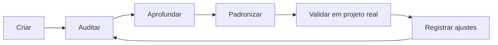

# Roadmap da CloudSix Engineering Intelligence Platform

## Objetivo

Definir a evolução planejada da CEIP por versões, mantendo clareza sobre fundação, agents, brains, engines, policies, playbooks, templates, checklists, arquiteturas de referência e módulos de governança operacional.

## Contexto

Um framework de engenharia precisa evoluir com uso real. O roadmap organiza incrementos sem transformar a documentação em um projeto fechado ou dependente de uma tecnologia específica.

## Versões planejadas

| Versão | Nome | Escopo |
| --- | --- | --- |
| v1.0 | Fundação | Constituição, manifesto, princípios, decisão, qualidade, segurança, performance, arquitetura, documentação, índice e guia de uso com IA |
| v1.1 | Agentes | Perfis completos dos 18 agentes, prompts individuais e fluxo oficial de orquestração |
| v1.2 | Playbooks | Procedimentos operacionais para novo projeto, legado, refatoração, review, release, incidente, integração, migração, auditoria e performance |
| v1.3 | Templates | Modelos de ADR, RFC, PR, user story, especificação técnica, teste, release notes, incidente e revisão arquitetural |
| v1.4 | Checklists | Checklists por disciplina para validação operacional e revisão técnica |
| v2.0 | Arquiteturas de referência | Modelos para SaaS, ERP, CRM, marketplace, sistema legado, site institucional e sistema com IA |
| v2.1 | Constitution Engine | Leis operacionais por domínio para orientar humanos e IAs |
| v2.2 | Decision Trees e Reviews | Fluxogramas Mermaid, review engine e ADR/RFC repositories |
| v2.3 | Quality Operating System | Quality gates, score system, métricas e orquestrador |
| v2.4 | Knowledge Libraries | Knowledge base, patterns, anti-patterns, prompt library e recipes |
| v2.5 | Validação e Revisão | Suíte `validation`, rodadas especializadas e auditoria estrutural |
| v2.6 | Piloto Real | Teste controlado no GSA Oficina ou projeto equivalente |
| v2.7 | Especificação de CLI | Contrato do `cloudsix-engineering` antes de implementação |
| v2.8 | Engineering Intelligence Core | CEIP, brains especializados, layers, engines, policies e knowledge graph |
| v3.0 | Meta-Agentes e Plataforma | Governança consolidada com Core, meta-agentes e preparação para CLI |

## Critérios de evolução

- Toda nova versão deve preservar o caráter agnóstico de tecnologia.
- Mudanças estruturais devem atualizar `INDEX.md`, `README.md` e documentos relacionados.
- Novos padrões devem incluir objetivo, contexto, diretrizes, exemplos, checklist e conclusão.
- Novas decisões estruturais devem gerar ADR.
- Conteúdo adicionado deve ser útil em software empresarial real, não apenas descritivo.
- Novos módulos operacionais devem se conectar a `ORCHESTRATOR.md`, `INDEX.md`, quality gates e constitution.
- Novos módulos estratégicos devem declarar layer, engine, policy ou relação no Knowledge Graph.

## Ciclo recomendado

## Exemplos

- Ao adicionar um novo tipo de arquitetura de referência, criar documento em `docs/reference-architectures`, atualizar `INDEX.md` e avaliar se um ADR é necessário.
- Ao ajustar um agente, atualizar também o prompt equivalente em `docs/prompts`.
- Ao criar novo playbook, adicionar checklist mínimo ou referenciar checklist existente.
- Ao adicionar nova recipe, relacionar agentes, gates e validações.
- Ao identificar aprendizado recorrente, registrar em `knowledge` e avaliar se deve virar standard.
- Ao mudar a estrutura do framework, atualizar `validation/` e registrar achado em `audits/` quando aplicável.
- Ao validar em projeto real, registrar resultado em `pilots/`.
- Ao identificar decisão repetitiva, criar ou atualizar engine.
- Ao identificar regra repetitiva, criar ou atualizar policy.

## Checklist

- [ ] A versão tem escopo claro.
- [ ] A mudança mantém agnosticismo tecnológico.
- [ ] Documentos de navegação foram atualizados.
- [ ] Há exemplo prático quando aplicável.
- [ ] Há checklist operacional.
- [ ] Decisões estruturais foram registradas.
- [ ] Módulos operacionais foram conectados ao índice e ao orquestrador.
- [ ] Suíte de validação e rodadas especializadas foram atualizadas.
- [ ] Módulos novos foram conectados ao Engineering Intelligence Core.

## Conclusão

O roadmap orienta evolução contínua sem perder coerência. O framework deve amadurecer a partir de uso real, auditorias recorrentes e decisões documentadas.
