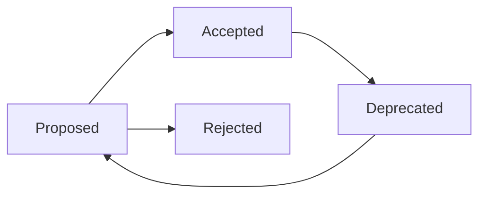

# ADR Repository

## Objetivo

Organizar decisões arquiteturais do framework e de projetos consumidores por status operacional: propostas, aceitas, rejeitadas e depreciadas.

## Contexto

`docs/adr` contém ADRs iniciais de fundação do framework. Esta pasta funciona como repositório vivo de decisões em evolução, com separação por ciclo de vida.

## Diretrizes

- Crie ADRs novas em `adr/proposed`.
- Mova para `adr/accepted` quando a decisão for aprovada.
- Mova para `adr/rejected` quando a alternativa for descartada.
- Mova para `adr/deprecated` quando a decisão aceita for substituída ou deixar de ser recomendada.
- Nunca apague ADR sem justificativa registrada.

## Fluxo

## Exemplos

- Uma proposta de nova estratégia de integração começa em `proposed`.
- Uma decisão de arquitetura substituída por nova abordagem vai para `deprecated`.

## Checklist

- [ ] ADR tem contexto e problema.
- [ ] Alternativas foram avaliadas.
- [ ] Status está correto.
- [ ] Consequências foram registradas.
- [ ] Links para RFCs e documentos relacionados existem quando aplicável.

## Conclusão

O ADR Repository preserva histórico de decisão e evita que o time redescubra discussões antigas.
