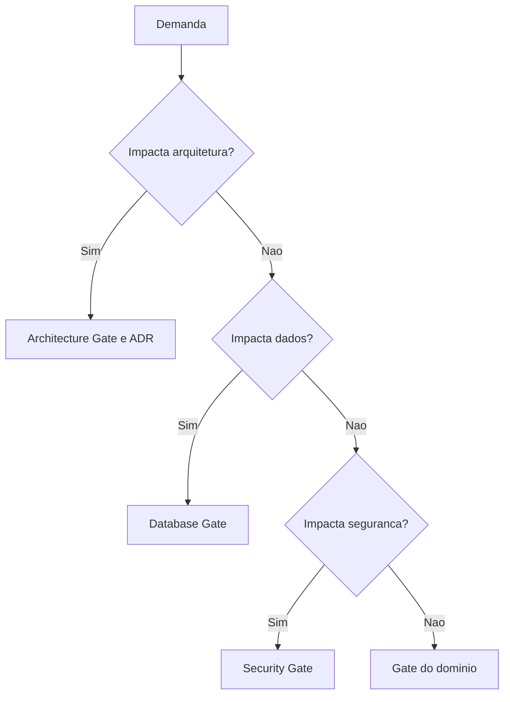

# Decision Trees

## Objetivo

Manter árvores de decisão em Mermaid para orientar escolhas recorrentes.

## Contexto

Este diretório existe para compatibilidade com o índice e pode ser expandido conforme a CEIP amadurece.

## Árvore base

## Checklist

- [ ] A pergunta de decisão é objetiva.
- [ ] Cada saída aponta gate ou documento.
- [ ] A árvore não assume tecnologia específica.

## Conclusão

Árvores de decisão tornam escolhas repetitivas mais consistentes.
