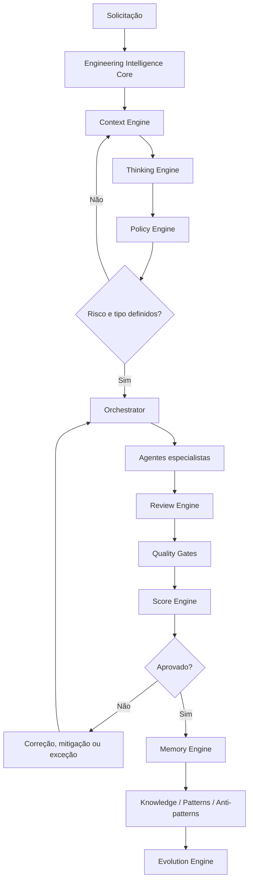

# Diagrama - Fluxo Operacional CEIP

## Objetivo

Representar o fluxo completo de uma demanda dentro da CEIP.

## Diagrama

## Uso

Use este diagrama em onboarding, auditoria e explicação do fluxo oficial.

## Checklist

- [ ] Policy Engine aparece antes do Orchestrator.
- [ ] Reviews, gates e score aparecem antes da conclusão.
- [ ] Aprendizado retorna para memória e evolução.

## Conclusão

O fluxo mostra a CEIP como plataforma operacional, não como coleção de documentos.
