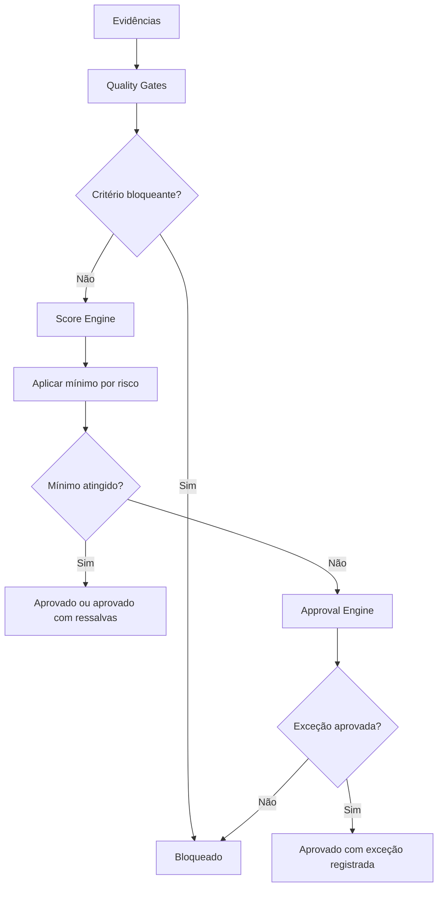

# Diagrama - Score e Aprovação

## Objetivo

Representar como scores, gates e aprovação formal se combinam.

## Diagrama

## Checklist

- [ ] Bloqueios de gate foram avaliados antes da média.
- [ ] Mínimo por risco foi aplicado.
- [ ] Exceção foi formalizada quando necessária.

## Conclusão

Score ajuda decisão, mas não compensa bloqueio crítico.
