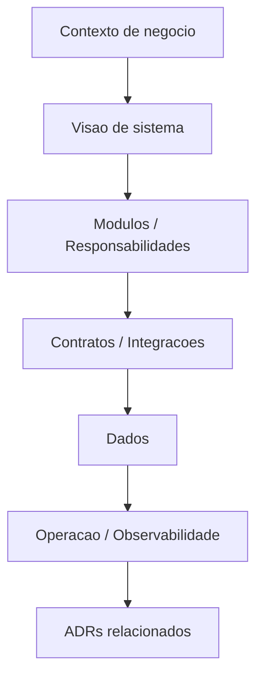

# Documentação de Arquitetura

## Objetivo

Definir como documentar arquitetura de sistemas consumidores do framework, sem impor desenho técnico específico.

## Contexto

Arquitetura precisa ser compreensível para pessoas, agentes de IA, revisores e operadores. Esta pasta existe para armazenar mapas, visões, decisões complementares e descrições arquiteturais de projetos que adotem o framework.

## Diretrizes

- Documentar visão atual antes de propor visão futura.
- Separar arquitetura conceitual, lógica, física e operacional quando necessário.
- Usar Mermaid para fluxos, dependências e contexto quando ajudar.
- Referenciar ADRs para decisões relevantes.
- Não desenhar arquitetura desejada como se já existisse.
- Registrar restrições de stack, equipe, dados, segurança e operação.

## Modelo recomendado

## Exemplos

- Mapa de módulos de um ERP.
- Diagrama de contexto de um SaaS.
- Fluxo de integração de marketplace.
- Visão de modernização de legado.

## Checklist

- [ ] Estado atual e estado desejado foram separados.
- [ ] Fronteiras e contratos foram descritos.
- [ ] Dados e fonte de verdade foram identificados.
- [ ] Operação e observabilidade foram consideradas.
- [ ] ADRs relacionados foram referenciados.

## Conclusão

Documentação arquitetural deve reduzir ambiguidade e apoiar decisões futuras, não apenas ilustrar componentes.
