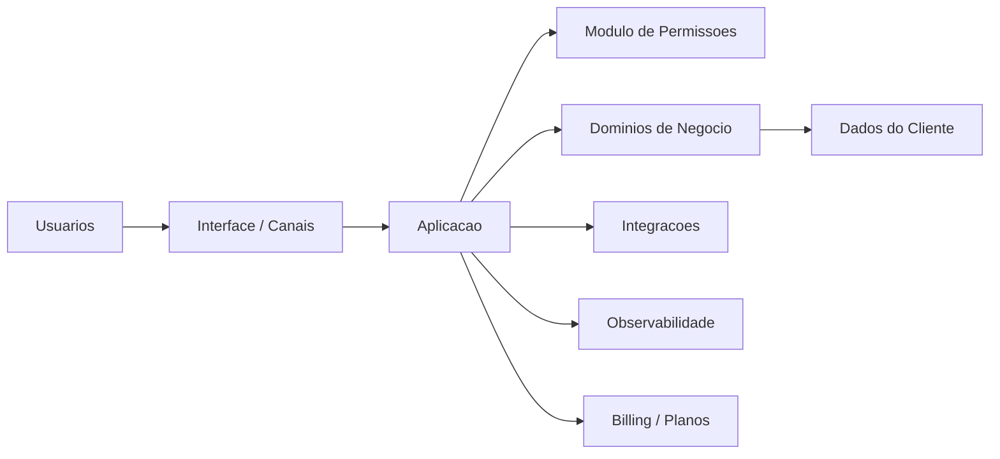

# Arquitetura de Referência - SaaS

## Objetivo

Descrever um modelo conceitual para sistemas SaaS empresariais sem impor stack.

## Contexto

SaaS costuma envolver múltiplos clientes, usuários, permissões, cobrança, configuração, integrações, relatórios, suporte e observabilidade.

## Diretrizes

- Definir modelo de tenancy conforme domínio e risco.
- Separar autenticação, autorização, configuração e dados de negócio.
- Projetar trilhas de auditoria para ações críticas.
- Planejar métricas de uso, cobrança e saúde operacional.
- Garantir evolução incremental e compatibilidade de contratos.

## Modelo conceitual

## Exemplos

- Portal administrativo multiempresa com permissões por perfil.
- SaaS de gestão com planos, limites e integrações externas.

## Checklist

- [ ] Modelo de tenancy foi definido.
- [ ] Permissões e dados por cliente foram avaliados.
- [ ] Billing ou limites foram considerados.
- [ ] Observabilidade por cliente existe quando necessário.
- [ ] Migrações preservam clientes existentes.

## Conclusão

Arquitetura SaaS deve equilibrar isolamento, operação, evolução e custo.
