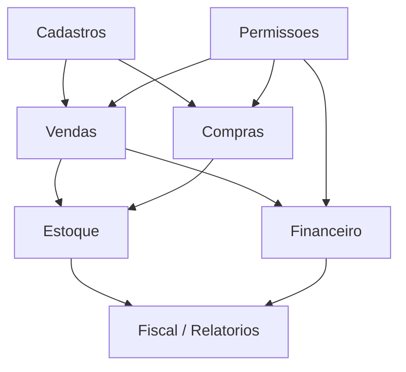

# Arquitetura de Referência - ERP

## Objetivo

Descrever arquitetura conceitual para ERP com módulos integrados, regras de negócio e dados consistentes.

## Contexto

ERP integra vendas, compras, estoque, financeiro, fiscal, cadastro, relatórios e permissões. Mudanças tendem a atravessar módulos.

## Diretrizes

- Definir módulos por processo de negócio.
- Preservar fonte de verdade para cadastros e transações.
- Auditar eventos críticos.
- Tratar relatórios como consumidores relevantes.
- Avaliar consistência transacional antes de separar componentes.

## Modelo conceitual

## Exemplos

- Pedido aprovado gera reserva de estoque e lançamento financeiro.
- Nota fiscal depende de dados de cliente, produtos e regras fiscais.

## Checklist

- [ ] Módulos e dependências foram mapeados.
- [ ] Fonte de verdade de dados críticos foi definida.
- [ ] Relatórios afetados foram considerados.
- [ ] Auditoria e histórico foram avaliados.
- [ ] Consistência entre módulos foi protegida.

## Conclusão

ERP exige arquitetura orientada a processo e consistência, com cuidado especial em dados e impactos cruzados.
