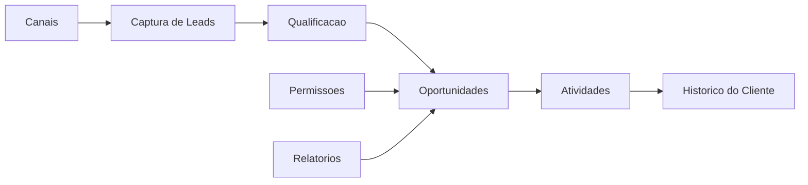

# Arquitetura de Referência - CRM

## Objetivo

Definir modelo conceitual para CRM com relacionamento, funil, atividades, permissões e integrações.

## Contexto

CRM gerencia clientes, leads, oportunidades, histórico de interações, tarefas, campanhas e relatórios comerciais. Dados pessoais e regras de acesso são pontos críticos.

## Diretrizes

- Definir entidades centrais: conta, contato, lead, oportunidade e atividade conforme domínio.
- Controlar acesso por equipe, carteira, perfil ou regra equivalente.
- Auditar alterações em dados sensíveis e oportunidades.
- Integrar canais externos com rastreabilidade.
- Planejar deduplicação e qualidade de dados.

## Modelo conceitual

## Exemplos

- Lead vindo de formulário cria atividade e atribuição para vendedor.
- Oportunidade muda de etapa e registra histórico auditável.

## Checklist

- [ ] Modelo de cliente e lead foi definido.
- [ ] Permissões por carteira ou equipe foram avaliadas.
- [ ] Histórico de interações foi planejado.
- [ ] Dados duplicados têm estratégia.
- [ ] Integrações de canais foram mapeadas.

## Conclusão

CRM eficaz protege relacionamento e histórico, mantendo dados confiáveis e acessos corretos.
