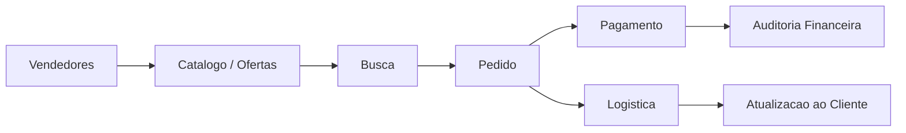

# Arquitetura de Referência - Marketplace

## Objetivo

Descrever arquitetura conceitual para marketplace com catálogo, vendedores, pedidos, pagamento e logística.

## Contexto

Marketplaces coordenam múltiplas partes com interesses e responsabilidades diferentes. Estoque, pagamento, comissão, entrega e disputa exigem contratos claros.

## Diretrizes

- Separar catálogo, oferta, pedido, pagamento e logística como responsabilidades distintas.
- Definir fonte de verdade para disponibilidade.
- Garantir idempotência em pagamento e webhooks.
- Registrar auditoria para eventos financeiros.
- Planejar busca e catálogo para volume crescente.

## Modelo conceitual

## Exemplos

- Vendedor atualiza preço e disponibilidade de item.
- Pedido confirmado aguarda pagamento e reserva disponibilidade.

## Checklist

- [ ] Responsabilidades foram separadas.
- [ ] Disponibilidade tem fonte de verdade.
- [ ] Pagamento tem idempotência.
- [ ] Comissão e auditoria foram avaliadas.
- [ ] Busca e catálogo têm estratégia de performance.

## Conclusão

Marketplace precisa de contratos sólidos para evitar inconsistência entre catálogo, pedido, pagamento e entrega.
