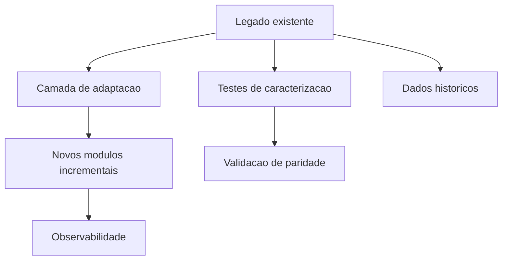

# Arquitetura de Referência - Sistema Legado

## Objetivo

Definir abordagem arquitetural para evolução de legado com proteção de comportamento.

## Contexto

Legados têm conhecimento implícito, dependências antigas, dados críticos e pouca cobertura. A arquitetura de referência prioriza mapeamento, contenção e modernização gradual.

## Diretrizes

- Inventariar módulos, jobs, integrações e dados.
- Criar testes de caracterização para fluxos críticos.
- Usar camadas de adaptação quando necessário para isolar dependências.
- Migrar por fatias com rollback.
- Registrar ADRs para cada decisão de modernização.

## Modelo conceitual

## Exemplos

- Encapsular integração antiga antes de substituir fornecedor.
- Criar testes para cálculo financeiro antes de refatorar módulo.

## Checklist

- [ ] Inventário foi feito.
- [ ] Fluxos críticos foram protegidos.
- [ ] Estratégia incremental foi definida.
- [ ] Dados históricos foram preservados.
- [ ] ADRs registram modernizações.

## Conclusão

Legado deve ser modernizado por redução contínua de risco, não por ruptura sem proteção.
