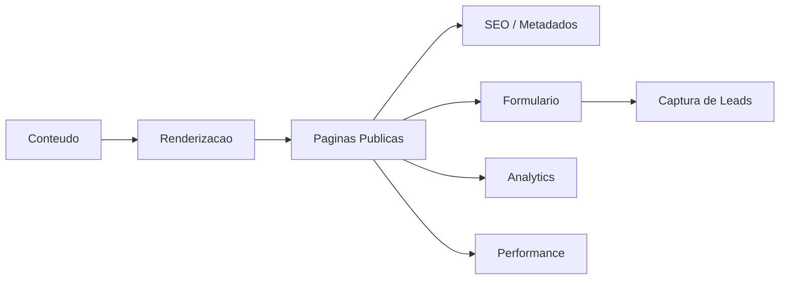

# Arquitetura de Referência - Site Institucional

## Objetivo

Descrever arquitetura conceitual para site institucional com conteúdo, performance, SEO, acessibilidade e manutenção.

## Contexto

Sites institucionais representam marca, capturam leads e comunicam serviços. A arquitetura deve equilibrar edição de conteúdo, carregamento rápido, segurança e mensuração.

## Diretrizes

- Definir fonte de conteúdo: arquivos, CMS, headless, banco ou outro.
- Garantir páginas indexáveis e metadados consistentes.
- Proteger formulários contra abuso.
- Monitorar performance e conversões.
- Minimizar dependências externas sem avaliação.

## Modelo conceitual

## Exemplos

- Página de serviço com metadados, formulário seguro e evento de conversão.
- Blog institucional com conteúdo indexável e autoria clara.

## Checklist

- [ ] Fonte de conteúdo foi definida.
- [ ] Metadados e indexação foram avaliados.
- [ ] Formulários são protegidos.
- [ ] Performance foi validada.
- [ ] Analytics respeita privacidade.

## Conclusão

Site institucional profissional é um produto digital operável, mensurável e rápido.
