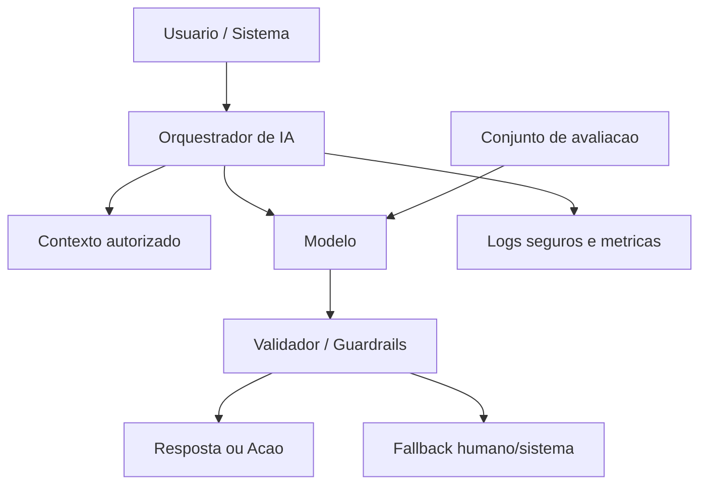

# Arquitetura de Referência - Sistema com IA

## Objetivo

Definir modelo conceitual para sistemas que usam IA com segurança, avaliação e governança.

## Contexto

IA pode apoiar busca, classificação, extração, recomendação, atendimento e automação. Como saídas podem ser probabilísticas, a arquitetura deve incluir limites, avaliação e fallback.

## Diretrizes

- Validar se IA é necessária e adequada.
- Controlar dados enviados ao modelo.
- Definir prompts, contexto, ferramentas e guardrails como artefatos versionáveis quando aplicável.
- Avaliar qualidade com exemplos reais.
- Prever revisão humana para decisões sensíveis.
- Monitorar custo, latência, erro e qualidade.

## Modelo conceitual

## Exemplos

- Assistente que resume chamados, mas não encerra ticket sem confirmação humana.
- Classificador de documentos com amostragem de revisão e métrica de precisão.

## Checklist

- [ ] Caso de uso justifica IA.
- [ ] Dados sensíveis foram minimizados.
- [ ] Critérios de avaliação existem.
- [ ] Guardrails e fallback foram definidos.
- [ ] Monitoramento de qualidade e custo existe.
- [ ] Limitações foram documentadas.

## Conclusão

Sistema com IA deve ser projetado como capacidade governada, mensurada e segura.
