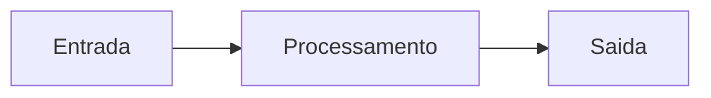

# Template de Especificação Técnica

## Objetivo

Descrever uma solução técnica proposta com contexto, arquitetura, contratos, riscos e validação.

## Contexto

Use quando a implementação envolver múltiplos componentes, integração, dados, segurança, performance ou operação.

## Template

````markdown
# Especificação Técnica - Título

## Objetivo

Problema técnico e resultado esperado.

## Contexto

Requisito, stack identificada, arquitetura atual, restrições e decisões relacionadas.

## Diretrizes

Documentos do framework aplicáveis e padrões locais.

## Solução proposta

Componentes afetados, fluxo e responsabilidades.

## Diagrama



## Contratos

Entradas, saídas, erros, eventos ou dados persistidos.

## Segurança

Permissões, dados sensíveis, validações e logs.

## Performance

Volume, latência, gargalos e métricas.

## Testes

Unitários, integração, contrato, regressão e validações manuais.

## Operação

Deploy, rollback, monitoramento e suporte.

## Checklist

- [ ] Stack foi identificada.
- [ ] Contratos foram documentados.
- [ ] Riscos foram mitigados.
- [ ] Testes foram definidos.

## Conclusão

Resumo da solução e próximos passos.
````

## Exemplos

Use para nova integração, mudança de fluxo crítico, módulo de cobrança, automação com IA ou alteração de arquitetura.

## Checklist

- [ ] Solução é compatível com arquitetura atual.
- [ ] Segurança e performance foram avaliadas.
- [ ] Testes e operação foram definidos.

## Conclusão

Especificação técnica reduz improviso e melhora revisão antes da implementação.
