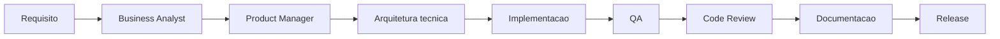

# 01 - Workflow de Feature Development

## Objetivo

Definir fluxo para desenvolver novas funcionalidades com análise, implementação, revisão, testes e documentação.

## Contexto

Features empresariais podem afetar usuários, permissões, dados, integrações e operação. O fluxo evita implementação antes de escopo e validação.

## Diretrizes

- Começar por requisito e valor.
- Identificar stack e padrões locais antes de implementar.
- Fatiar entrega em incremento pequeno.
- Validar com checklists antes de release.

## Fluxo

## Exemplos

Feature SaaS com nova tela deve passar por UX, backend, segurança, QA e review antes de release.

## Checklist

- [ ] Requisito e critérios de aceite existem.
- [ ] Stack foi identificada.
- [ ] Impactos foram avaliados.
- [ ] Testes foram executados.
- [ ] Documentação foi atualizada.
- [ ] Release foi planejada.

## Conclusão

Feature pronta é aquela que entrega valor sem criar risco invisível.
