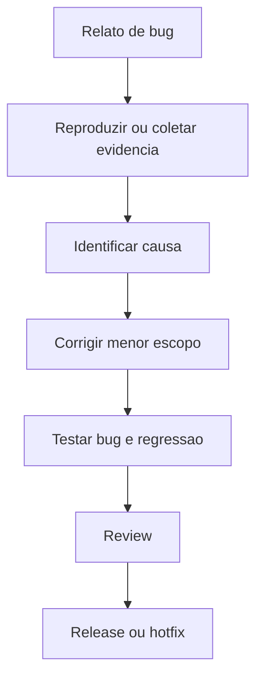

# 02 - Workflow de Bugfix

## Objetivo

Corrigir defeitos com reprodução, causa raiz, alteração mínima e validação de regressão.

## Contexto

Bugfix apressado pode corrigir sintoma e criar novo problema. O fluxo exige entender o comportamento esperado e o comportamento atual.

## Diretrizes

- Reproduzir ou localizar evidência antes de corrigir.
- Confirmar regra de negócio.
- Corrigir menor escopo viável.
- Adicionar teste quando o bug for relevante ou recorrente.

## Fluxo

## Exemplos

Erro em cálculo deve ser validado com caso que falhava e casos históricos próximos.

## Checklist

- [ ] Comportamento esperado foi confirmado.
- [ ] Bug foi reproduzido ou evidenciado.
- [ ] Causa provável foi identificada.
- [ ] Correção é localizada.
- [ ] Teste cobre a regressão.

## Conclusão

Bugfix confiável resolve causa com evidência e evita reintrodução do defeito.
