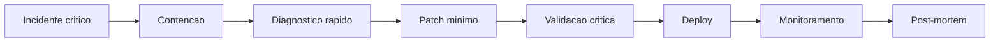

# 03 - Workflow de Hotfix

## Objetivo

Corrigir problema crítico em produção com contenção rápida, validação mínima segura e rastreabilidade.

## Contexto

Hotfix prioriza redução de impacto, mas não elimina responsabilidade sobre segurança, dados, rollback e comunicação.

## Diretrizes

- Classificar severidade.
- Conter impacto antes de solução definitiva quando necessário.
- Manter escopo mínimo.
- Registrar follow-up técnico após estabilização.

## Fluxo

## Exemplos

Se uma exportação expõe dados indevidos, primeiro desabilite a rota ou ação afetada, depois corrija autorização e audite acessos.

## Checklist

- [ ] Impacto foi classificado.
- [ ] Contenção foi avaliada.
- [ ] Patch é mínimo.
- [ ] Validação crítica foi executada.
- [ ] Monitoramento pós-deploy existe.
- [ ] Follow-up foi registrado.

## Conclusão

Hotfix seguro corrige produção sem transformar urgência em dívida invisível.
