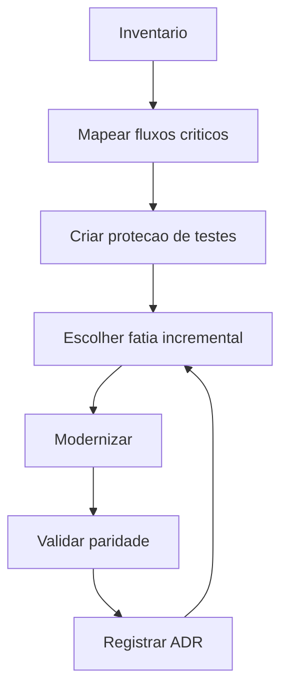

# 04 - Workflow de Modernização de Legado

## Objetivo

Modernizar sistemas legados com redução progressiva de risco e preservação de comportamento.

## Contexto

Modernização pode envolver refatoração, testes, modularização, migração de dados, melhoria de UX, atualização de runtime ou substituição de integrações.

## Diretrizes

- Inventariar antes de alterar.
- Proteger comportamento com testes de caracterização.
- Priorizar áreas de maior valor ou risco.
- Evitar reescrita total sem justificativa e plano.

## Fluxo

## Exemplos

Modernizar módulo financeiro começa por caracterizar cálculos e relatórios antes de alterar estrutura.

## Checklist

- [ ] Inventário técnico foi feito.
- [ ] Fluxos críticos foram mapeados.
- [ ] Testes de caracterização existem ou foram planejados.
- [ ] Fatiamento incremental foi definido.
- [ ] Paridade foi validada.
- [ ] ADRs foram criados quando necessário.

## Conclusão

Modernização bem-sucedida reduz risco a cada etapa, não apenas no final.
