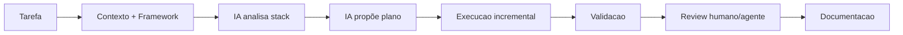

# 05 - Workflow de Desenvolvimento Assistido por IA

## Objetivo

Usar IA em desenvolvimento com contexto, limites, revisão e validação técnica.

## Contexto

Agentes de IA podem acelerar análise e implementação, mas também podem inventar regras, assumir stack errada ou gerar conteúdo superficial. Este fluxo controla esse risco.

## Diretrizes

- Fornecer contexto e documentos do framework.
- Exigir identificação da stack.
- Revisar saídas por agente especialista ou humano.
- Validar com testes e checklists.

## Fluxo

## Exemplos

Para criar documentação, peça primeiro estrutura, depois criação, depois auditoria com o prompt de `AI_USAGE_GUIDE.md`.

## Checklist

- [ ] IA recebeu contexto suficiente.
- [ ] Stack foi identificada.
- [ ] Limites foram definidos.
- [ ] Saída foi revisada.
- [ ] Testes ou checklists foram usados.
- [ ] Documentação foi atualizada.

## Conclusão

IA deve ampliar capacidade de engenharia sem substituir responsabilidade técnica.
