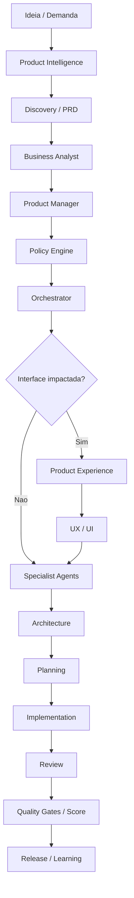

# 06 - Workflow de Orquestração de Agentes

## Objetivo

Definir como combinar agentes especialistas em uma sequência coerente para resolver demandas complexas.

## Contexto

Demandas de software empresarial atravessam negócio, produto, arquitetura, dados, frontend, backend, segurança, performance, QA e operação. Orquestração evita decisões isoladas.

## Diretrizes

- Começar por Product Intelligence quando houver ideia, produto, feature, módulo, API ou integração relevante.
- Acionar Business Analysis e Product Management depois de Discovery e PRD.
- Aplicar Policy Engine antes do Orchestrator em tarefas relevantes.
- Acionar Product Experience quando houver interface, dashboard, formulário, tabela, site ou experiência responsiva relevante.
- Chamar especialistas conforme impacto definido pelo Orchestrator.
- Finalizar com review, Quality Gates, Score, release e aprendizado.

## Fluxo

## Exemplos

Uma feature de marketplace com pagamento e nova tela aciona Product Intelligence, Business Analyst, Product Manager, Policy Engine, Orchestrator, Product Experience, Architecture, API Integration, Backend, Database, Security, QA, DevOps e Documentation.

## Checklist

- [ ] Product Intelligence foi aplicado quando obrigatório.
- [ ] Product Experience foi aplicado quando obrigatório.
- [ ] Policy Engine classificou tarefa e risco antes do Orchestrator.
- [ ] Arquitetura avaliou impacto estrutural depois de PRD e policies.
- [ ] Especialistas foram chamados pelo risco.
- [ ] Review, Quality Gates e Score fecharam a entrega.
- [ ] Documentação registrou decisões.

## Conclusão

Orquestração correta reduz lacunas entre especialidades e melhora a qualidade da decisão final.
