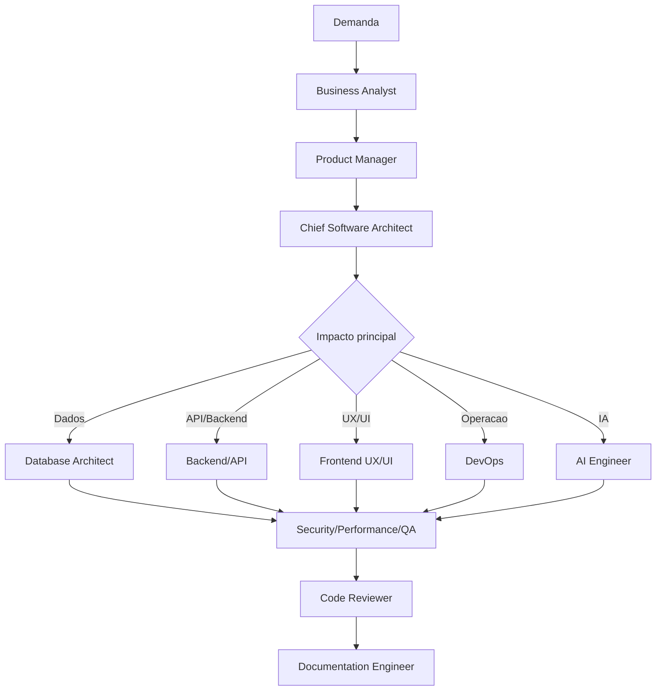

# 06 - Workflow de Orquestração de Agentes

## Objetivo

Definir como combinar agentes especialistas em uma sequência coerente para resolver demandas complexas.

## Contexto

Demandas de software empresarial atravessam negócio, produto, arquitetura, dados, frontend, backend, segurança, performance, QA e operação. Orquestração evita decisões isoladas.

## Diretrizes

- Começar por entendimento de negócio e produto.
- Acionar arquitetura antes de decisões estruturais.
- Chamar especialistas conforme impacto.
- Finalizar com QA, review e documentação.

## Fluxo

## Exemplos

Uma feature de marketplace com pagamento aciona Business Analyst, Product Manager, Architect, API Integration, Backend, Database, Security, QA, DevOps e Documentation.

## Checklist

- [ ] Agentes iniciais foram negócio e produto.
- [ ] Arquitetura avaliou impacto estrutural.
- [ ] Especialistas foram chamados pelo risco.
- [ ] QA e review fecharam a entrega.
- [ ] Documentação registrou decisões.

## Conclusão

Orquestração correta reduz lacunas entre especialidades e melhora a qualidade da decisão final.
