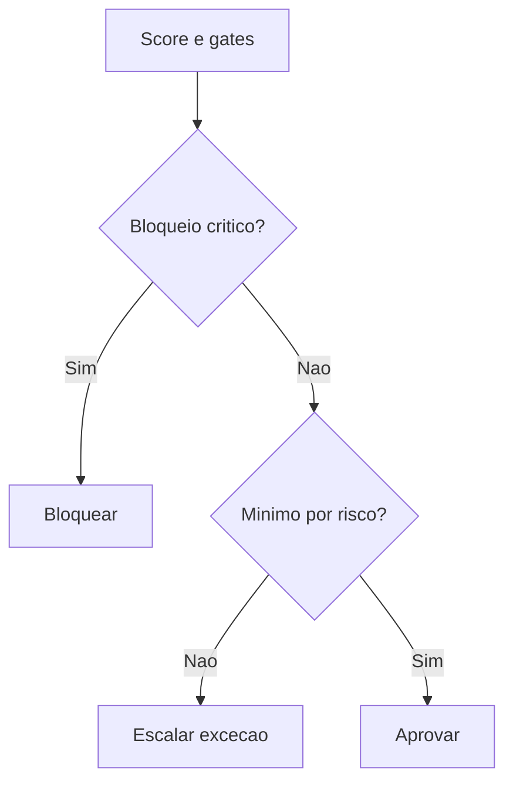

# Approval Engine

## Objetivo

Definir quando uma entrega pode avançar, quando deve ser bloqueada e quem precisa aprovar exceções.

## Entradas

- Classificação de risco.
- Resultado de gates e reviews.
- Score consolidado.
- Exceções solicitadas.

## Processamento

1. Consultar mínimos por risco.
2. Verificar bloqueios obrigatórios.
3. Identificar aprovadores requeridos.
4. Registrar decisão, justificativa e validade da exceção.

## Saídas

- Aprovação, aprovação com ressalva ou bloqueio.
- Lista de responsáveis pela decisão.
- Registro de exceção quando aplicável.

## Políticas relacionadas

- `policy-engine/APPROVAL_POLICIES.md`
- `policy-engine/ESCALATION_POLICIES.md`
- `policy-engine/QUALITY_GATE_POLICIES.md`

## Agentes envolvidos

Chief Engineering Officer, Quality Governor, Chief Software Architect, Product Manager, Security Engineer e DevOps Engineer.

## Quality gates aplicáveis

Todos os gates que apresentaram bloqueio, ressalva ou evidência obrigatória.

## Fluxo

## Exemplos

- Risco crítico com score 88 deve ser bloqueado ou aprovado apenas por exceção formal.
- Falha documental em tarefa de baixo risco pode gerar aprovação com ressalva e prazo de correção.

## Checklist de validação

- [ ] A decisão respeita mínimos por risco.
- [ ] Bloqueios críticos foram tratados.
- [ ] Aprovadores corretos foram envolvidos.
- [ ] Exceções têm prazo e justificativa.
- [ ] A decisão foi registrada.

## Conclusão

Aprovação é uma decisão de governança, não apenas ausência de objeção.
