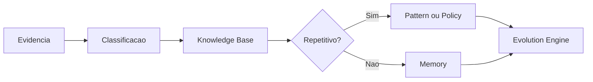

# Knowledge Engine

## Objetivo

Transformar aprendizados, decisões, padrões, incidentes e exemplos em conhecimento reutilizável pela CEIP.

## Entradas

- ADRs, RFCs, reviews, incidentes e retrospectivas.
- Registros em `knowledge/`, `memory/`, `patterns/` e `anti-patterns/`.
- Evidências de projetos piloto e validações.

## Processamento

1. Classificar o aprendizado por domínio.
2. Separar fato, decisão, hipótese e recomendação.
3. Relacionar o aprendizado com policies, agents, gates e métricas.
4. Indicar se o conteúdo deve virar padrão, receita, anti-pattern ou memória.

## Saídas

- Atualização de knowledge base.
- Novo pattern, anti-pattern, recipe, ADR ou RFC.
- Recomendação para Memory Engine ou Evolution Engine.

## Políticas relacionadas

- `policy-engine/DOCUMENTATION_POLICIES.md`
- `policy-engine/DECISION_POLICIES.md`
- `policies/knowledge-reuse-policy.md`

## Agentes envolvidos

Knowledge Curator, Documentation Engineer, Chief Software Architect, QA Engineer e agente especialista do domínio afetado.

## Quality gates aplicáveis

- `quality-gates/documentation-gate.md`
- `quality-gates/architecture-gate.md` quando houver decisão estrutural.
- `quality-gates/ai-agent-gate.md` quando o aprendizado orientar agentes de IA.

## Fluxo

## Exemplos

- Um erro recorrente de integração vira anti-pattern e regra de revisão.
- Uma solução de performance comprovada vira pattern com critérios de uso.
- Uma decisão de arquitetura vira ADR e referência em arquitetura de referência.

## Checklist de validação

- [ ] O aprendizado tem evidência concreta.
- [ ] O domínio foi classificado corretamente.
- [ ] Não há dado sensível desnecessário.
- [ ] A recomendação aponta documento de destino.
- [ ] O índice foi atualizado quando necessário.

## Conclusão

O Knowledge Engine evita que a organização reaprenda o mesmo problema repetidamente.
