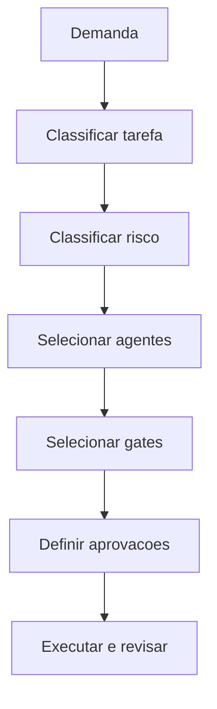

# Orchestrator Engine

## Objetivo

Selecionar a sequência correta de brains, engines, agentes, quality gates e aprovações para cada demanda.

## Entradas

- Solicitação do usuário.
- Tipo de tarefa, risco, impacto e urgência.
- Policies de roteamento e aprovação.
- Contexto do projeto e documentos existentes.

## Processamento

1. Classificar a demanda.
2. Consultar `policy-engine/AGENT_ROUTING_POLICIES.md`.
3. Definir agentes obrigatórios e opcionais.
4. Definir gates, evidências, aprovações e handoffs.
5. Encaminhar para Review Engine e Quality Engine antes da conclusão.

## Saídas

- Plano de orquestração.
- Ordem de execução dos agentes.
- Lista de quality gates e aprovações.
- Critérios de encerramento.

## Políticas relacionadas

- `policy-engine/AGENT_ROUTING_POLICIES.md`
- `policy-engine/ESCALATION_POLICIES.md`
- `policy-engine/APPROVAL_POLICIES.md`

## Agentes envolvidos

Technical Program Manager, Chief Engineering Officer, Chief Software Architect, Product Manager e Quality Governor.

## Quality gates aplicáveis

Todos os gates podem ser acionados conforme o impacto identificado.

## Fluxo

## Exemplos

- Mudança de banco com risco alto exige Database Architect, Backend Engineer, QA, Security, ADR e aprovação técnica.
- Ajuste visual de baixo risco pode exigir Frontend UX Specialist, UI Designer e checklist frontend.

## Checklist de validação

- [ ] O tipo de tarefa foi classificado.
- [ ] O risco foi classificado.
- [ ] Agentes obrigatórios foram acionados.
- [ ] Gates e aprovações foram definidos.
- [ ] Handoff e evidências foram registrados.

## Conclusão

O Orchestrator Engine impede execução desordenada e torna explícito quem decide, valida e aprova.
