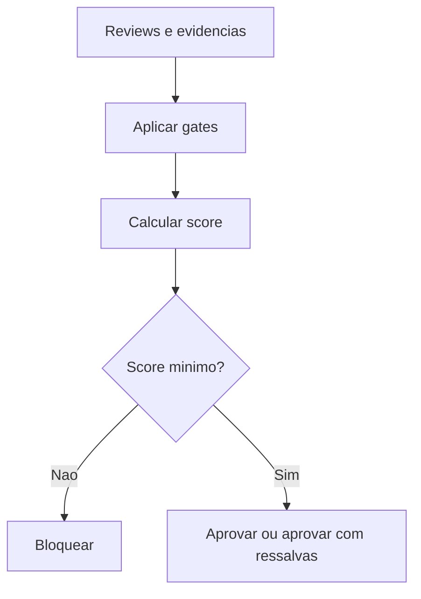

# Quality Engine

## Objetivo

Avaliar se uma entrega atende ao padrão mínimo de qualidade definido pela CEIP antes de ser considerada concluída.

## Entradas

- Resultado de reviews.
- Quality gates aplicáveis.
- Métricas, testes, evidências e documentação.
- Classificação de risco.
- Artefatos do Product Intelligence System quando a entrega envolve produto, feature, módulo, API ou integração relevante.

## Processamento

1. Identificar gates obrigatórios.
2. Verificar se `quality-gates/product-intelligence-gate.md` se aplica.
3. Verificar critérios mandatórios e bloqueantes.
4. Solicitar score ao Score Engine.
5. Consolidar evidências.
6. Aprovar, bloquear ou aprovar com ressalvas conforme política.

## Saídas

- Parecer de qualidade.
- Score consolidado.
- Lista de lacunas e bloqueios.
- Decisão de aprovação ou rejeição.

## Políticas relacionadas

- `policy-engine/QUALITY_GATE_POLICIES.md`
- `policy-engine/PRODUCT_INTELLIGENCE_POLICIES.md`
- `policy-engine/APPROVAL_POLICIES.md`
- `QUALITY_STANDARD.md`

## Agentes envolvidos

Quality Governor, QA Engineer, Code Reviewer Tech Lead, Security Engineer, Performance Engineer e Documentation Engineer.

## Quality gates aplicáveis

Todos os documentos em `quality-gates/`.

Para produto, feature, módulo, API ou integração relevante, aplicar também `quality-gates/product-intelligence-gate.md`.

## Fluxo

## Exemplos

- Uma alteração crítica só passa se tiver score mínimo 90 e nenhum bloqueio de segurança.
- Uma feature relevante sem PRD ou critérios de aceite é bloqueada pelo Product Intelligence Gate antes de revisão técnica.
- Uma documentação interna de baixo risco pode ser aceita com score mínimo 70.

## Checklist de validação

- [ ] Gates obrigatórios foram aplicados.
- [ ] Product Intelligence Gate foi aplicado quando obrigatório.
- [ ] Critérios bloqueantes foram verificados.
- [ ] Scores foram calculados.
- [ ] Evidências foram anexadas.
- [ ] A decisão está alinhada ao risco.

## Conclusão

O Quality Engine transforma qualidade em decisão operacional verificável.
