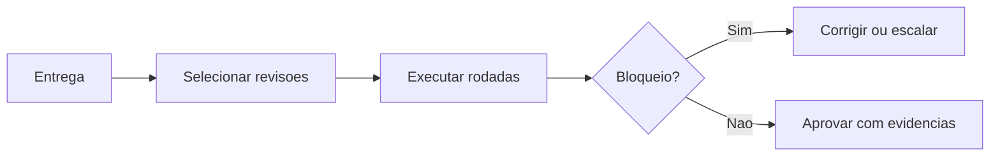

# Review Engine

## Objetivo

Coordenar revisões especializadas para encontrar inconsistências, riscos, lacunas e bloqueios antes da entrega.

## Entradas

- Entrega proposta.
- Critérios de aceite.
- ADRs, RFCs, diffs, especificações e evidências.
- Quality gates aplicáveis.

## Processamento

1. Determinar rodadas de revisão necessárias.
2. Aplicar revisão por domínio.
3. Classificar achados por severidade.
4. Encaminhar bloqueios para correção ou aprovação excepcional.
5. Registrar conclusão e risco residual.

## Saídas

- Parecer de revisão.
- Lista de bloqueios e recomendações.
- Evidências para Quality Engine.

## Políticas relacionadas

- `policy-engine/QUALITY_GATE_POLICIES.md`
- `policy-engine/RISK_POLICIES.md`
- `policy-engine/ESCALATION_POLICIES.md`

## Agentes envolvidos

Code Reviewer Tech Lead, QA Engineer, Security Engineer, Performance Engineer, Documentation Engineer e especialistas do domínio.

## Quality gates aplicáveis

- `quality-gates/qa-gate.md`
- `quality-gates/security-gate.md`
- `quality-gates/performance-gate.md`
- `quality-gates/documentation-gate.md`

## Fluxo

## Exemplos

- Uma feature crítica passa por revisão de negócio, arquitetura, segurança, QA e documentação.
- Uma mudança documental passa por Documentation Engineer e validação de links.

## Checklist de validação

- [ ] A revisão tem escopo claro.
- [ ] Achados têm severidade e evidência.
- [ ] Bloqueios foram tratados.
- [ ] Risco residual foi declarado.
- [ ] Resultado alimenta o Quality Engine.

## Conclusão

O Review Engine cria disciplina de revisão sem depender de opinião genérica.
