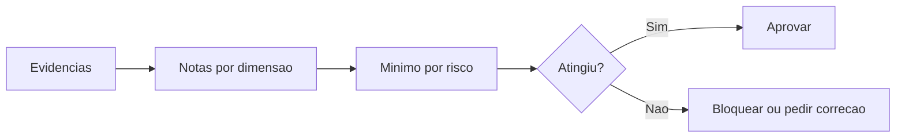

# Score Engine

## Objetivo

Pontuar entregas, decisões e artefatos em escala de 0 a 100 para orientar aprovação, bloqueio e melhoria contínua.

## Entradas

- Critérios dos quality gates.
- Visual Quality Score quando houver interface impactada.
- Métricas em `metrics/`.
- Resultado de reviews.
- Classificação de risco.

## Processamento

1. Selecionar dimensões aplicáveis: qualidade, risco, segurança, performance, manutenibilidade e experiência quando houver interface.
2. Atribuir nota de 0 a 100 para cada dimensão.
3. Aplicar mínimos por risco.
4. Bloquear quando houver critério crítico não atendido, mesmo com média alta.
5. Registrar justificativa e evidência.

## Método de cálculo

O score consolidado deve usar apenas dimensões aplicáveis à entrega. Quando a entrega não tiver impacto relevante de interface, use pesos padrão:

| Dimensão | Peso padrão |
| --- | --- |
| Qualidade | 30 |
| Risco | 20 |
| Segurança | 20 |
| Performance | 15 |
| Manutenibilidade | 15 |

Quando uma dimensão não se aplicar, redistribua o peso proporcionalmente entre as dimensões restantes e registre a justificativa.

Quando a entrega tiver interface relevante, use perfil com experiência:

| Dimensão | Peso padrão |
| --- | ---: |
| Qualidade | 20 |
| Risco | 15 |
| Segurança | 15 |
| Performance | 10 |
| Manutenibilidade | 10 |
| Experiência visual | 30 |

O score de Experiência visual deve vir de `metrics/visual-quality-score.md` ou de `product-experience/VISUAL_QUALITY_SCORE.md`.

## Regras não compensatórias

- Falha crítica de segurança bloqueia a entrega mesmo com score consolidado alto.
- Falha em critério obrigatório de gate bloqueia até correção ou aprovação excepcional.
- Falha crítica no Product Experience Gate bloqueia interface relevante mesmo com score consolidado alto.
- Ausência de evidência reduz a nota da dimensão correspondente para no máximo 60.
- Risco crítico sem rollback ou contingência deve ser tratado como bloqueio, salvo exceção formal.

## Saídas

- Score por dimensão.
- Score consolidado.
- Status: aprovado, aprovado com ressalvas ou bloqueado.
- Recomendação de melhoria.

## Políticas relacionadas

- `policy-engine/QUALITY_GATE_POLICIES.md`
- `policy-engine/RISK_POLICIES.md`
- `policy-engine/APPROVAL_POLICIES.md`

## Agentes envolvidos

Quality Governor, QA Engineer, Security Engineer, Performance Engineer, Frontend UX Specialist, UI Designer, Code Reviewer Tech Lead e Documentation Engineer.

## Quality gates aplicáveis

Todos os gates aplicáveis ao tipo de entrega.

Quando houver interface impactada, aplicar também `quality-gates/product-experience-gate.md` e `metrics/visual-quality-score.md`.

## Escala oficial

| Pontuação | Interpretação |
| --- | --- |
| 90-100 | Excelente |
| 80-89 | Bom |
| 70-79 | Aceitável com ressalvas |
| 60-69 | Fraco |
| Abaixo de 60 | Bloqueado |

## Mínimos por risco

| Risco | Score mínimo |
| --- | --- |
| Crítico | 90 |
| Alto | 85 |
| Médio | 80 |
| Baixo | 70 |

## Fluxo

## Exemplos

Mudança de API com risco alto:

| Dimensão | Nota | Evidência |
| --- | --- | --- |
| Qualidade | 86 | Critérios de aceite e testes de contrato |
| Risco | 82 | Impacto mapeado, mas rollback parcial |
| Segurança | 90 | Autorização e validação revisadas |
| Performance | 78 | Baseline existe, monitoramento pendente |
| Manutenibilidade | 84 | Contratos documentados |

Score consolidado: 84. Como o risco é alto, o mínimo é 85. Resultado: bloqueado até melhorar performance, rollback ou risco residual.

Interface SaaS com risco médio:

| Dimensão | Nota | Evidência |
| --- | --- | --- |
| Hierarquia | 92 | Ação principal e prioridade visual documentadas |
| Acessibilidade | 86 | Contraste, foco e estados avaliados |
| Interação | 88 | Loading, erro, vazio e sucesso definidos |
| Premium feel | 90 | Product Experience Gate aprovado |

Visual Quality Score: 89. Como o risco é médio, o mínimo é 80. Resultado: aprovado.

## Checklist de validação

- [ ] A classificação de risco foi definida antes do score.
- [ ] Cada nota tem evidência.
- [ ] Critérios bloqueantes foram avaliados separadamente.
- [ ] O mínimo por risco foi aplicado.
- [ ] O score final foi registrado.
- [ ] Regras não compensatórias foram avaliadas.
- [ ] Visual Quality Score foi aplicado quando a entrega impactou interface.

## Conclusão

O Score Engine reduz subjetividade sem substituir julgamento técnico.
