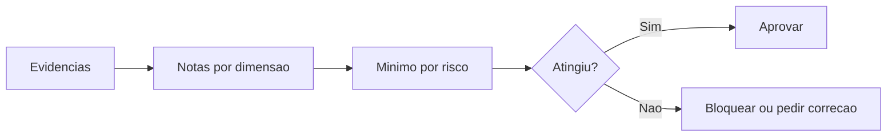

# Score Engine

## Objetivo

Pontuar entregas, decisões e artefatos em escala de 0 a 100 para orientar aprovação, bloqueio e melhoria contínua.

## Entradas

- Critérios dos quality gates.
- Métricas em `metrics/`.
- Resultado de reviews.
- Classificação de risco.

## Processamento

1. Selecionar dimensões aplicáveis: qualidade, risco, segurança, performance e manutenibilidade.
2. Atribuir nota de 0 a 100 para cada dimensão.
3. Aplicar mínimos por risco.
4. Bloquear quando houver critério crítico não atendido, mesmo com média alta.
5. Registrar justificativa e evidência.

## Saídas

- Score por dimensão.
- Score consolidado.
- Status: aprovado, aprovado com ressalvas ou bloqueado.
- Recomendação de melhoria.

## Políticas relacionadas

- `policy-engine/QUALITY_GATE_POLICIES.md`
- `policy-engine/RISK_POLICIES.md`
- `policy-engine/APPROVAL_POLICIES.md`

## Agentes envolvidos

Quality Governor, QA Engineer, Security Engineer, Performance Engineer, Code Reviewer Tech Lead e Documentation Engineer.

## Quality gates aplicáveis

Todos os gates aplicáveis ao tipo de entrega.

## Escala oficial

| Pontuação | Interpretação |
| --- | --- |
| 90-100 | Excelente |
| 80-89 | Bom |
| 70-79 | Aceitável com ressalvas |
| 60-69 | Fraco |
| Abaixo de 60 | Bloqueado |

## Mínimos por risco

| Risco | Score mínimo |
| --- | --- |
| Crítico | 90 |
| Alto | 85 |
| Médio | 80 |
| Baixo | 70 |

## Fluxo

## Checklist de validação

- [ ] A classificação de risco foi definida antes do score.
- [ ] Cada nota tem evidência.
- [ ] Critérios bloqueantes foram avaliados separadamente.
- [ ] O mínimo por risco foi aplicado.
- [ ] O score final foi registrado.

## Conclusão

O Score Engine reduz subjetividade sem substituir julgamento técnico.
