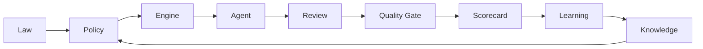

# Knowledge Graph

## Objetivo

Definir o modelo conceitual do grafo de conhecimento da CEIP.

## Contexto

A Knowledge Base armazena conteúdo. O Knowledge Graph define relações entre leis, políticas, agentes, engines, gates, ADRs, RFCs, patterns, anti-patterns, recipes e aprendizados.

## Diretrizes

- Relacionar artefatos por tipo de decisão e domínio.
- Usar o grafo para explicar por que uma recomendação existe.
- Atualizar relações quando novos módulos forem criados.
- Não depender de ferramenta específica de grafo nesta fase.

## Entidades

| Entidade | Exemplo |
| --- | --- |
| Law | `LAW-001` |
| Policy | `Stack Discovery Policy` |
| Engine | `Context Engine` |
| Agent | `Backend Engineer` |
| Gate | `Security Gate` |
| Review | `Security Review` |
| ADR | `ADR-0001` |
| RFC | `RFC-0005` |
| Pattern | `Adapter` |
| Anti-pattern | `Tight Coupling` |
| Recipe | `Criar API` |
| Learning | Lição de piloto |

## Relações

## Exemplos

- `Stack Discovery Policy` deriva de `LAW-002`, é aplicada pelo `Context Engine` e validada em `validation/structural-validation.md`.
- `Adapter Pattern` pode ser recomendado pelo `Architecture Brain` em integrações externas e revisado por `architecture-review.md`.

## Checklist

- [ ] Artefato novo tem relações claras.
- [ ] Policy relacionada foi identificada.
- [ ] Agente ou engine consumidor foi identificado.
- [ ] Aprendizado pode ser rastreado.

## Conclusão

Knowledge Graph permite que a CEIP explique recomendações por relações, não por memória implícita.
