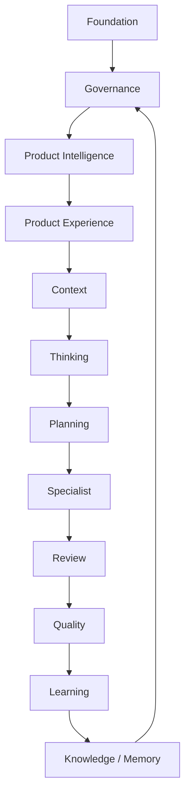

# Layers da CEIP

## Objetivo

Definir as camadas obrigatórias da CloudSix Engineering Intelligence Platform e a responsabilidade de cada uma.

## Contexto

Pensar a CEIP por camadas evita que o repositório cresça como coleção de arquivos sem arquitetura. Cada camada responde por uma capacidade da plataforma.

## Diretrizes

- Cada módulo novo deve pertencer a uma camada.
- Camadas devem ser conectadas pelo Engineering Intelligence Core.
- Quando uma limitação surgir, a plataforma deve identificar em qual camada ela pertence.
- Nenhuma camada deve assumir tecnologia específica.

## Camadas

| Layer | Responsabilidade | Módulos atuais |
| --- | --- | --- |
| Foundation Layer | Base institucional e princípios | `README.md`, `MANIFESTO.md`, `CONSTITUTION.md`, `PLATFORM.md` |
| Governance Layer | Leis, políticas, riscos e mudança | `constitution`, `policies`, `RISK_MANAGEMENT.md`, `CHANGE_MANAGEMENT.md` |
| Knowledge Layer | Conhecimento reutilizável | `knowledge`, `patterns`, `anti-patterns`, `knowledge-graph` |
| Product Intelligence Layer | Discovery, PRD, requisitos, MVP, roadmap e backlog antes da engenharia | `product-intelligence` |
| Product Experience Layer | Experiência premium, CDL, layout, interação, acessibilidade e score visual antes de UX/UI/Frontend | `product-experience` |
| Thinking Layer | Análise antes de solução | `engines/thinking-engine.md`, `prompts/analysis` |
| Planning Layer | Plano incremental e dependências | `engines/planning-engine.md`, `NEXT_STEPS.md`, `prompts/planning` |
| Context Layer | Construção de contexto | `engines/context-engine.md`, `cli/context-model.md` |
| Memory Layer | Memória e rastreabilidade | `adr`, `rfc`, `audits`, `knowledge` |
| Specialist Layer | Agentes especialistas | `docs/agents`, `docs/prompts` |
| Policy Layer | Políticas aplicáveis | `policies`, `constitution`, `engines/policy-engine.md` |
| Orchestration Layer | Coordenação de fluxo | `ORCHESTRATOR.md`, `meta-agents` |
| Review Layer | Revisões especializadas | `review`, `specialist-reviews` |
| Quality Layer | Gates, score e métricas | `quality-gates`, `score-system`, `metrics` |
| Learning Layer | Evolução contínua | `engines/evolution-engine.md`, `pilots`, `validation` |
| Execution Layer | Execução guiada | `docs/playbooks`, `docs/templates`, `recipes`, `docs/reference-architectures` |

## Diagrama

## Exemplos

- Um novo comando CLI pertence inicialmente ao Execution Layer, mas pode consultar Context, Policy e Quality.
- Uma nova ideia de produto pertence inicialmente ao Product Intelligence Layer antes de seguir para Business, Architecture e Engineering.
- Uma nova interface relevante pertence ao Product Experience Layer antes de seguir para UX, UI, Frontend e QA.
- Um aprendizado do piloto pertence ao Learning Layer e deve atualizar Knowledge ou Policy.

## Checklist

- [ ] O módulo novo pertence a uma layer.
- [ ] A layer tem responsabilidade clara.
- [ ] O módulo se conecta ao Core.
- [ ] Não há duplicação entre layers.

## Conclusão

Layers transformam a CEIP em plataforma arquitetada, não em diretório acumulativo.
