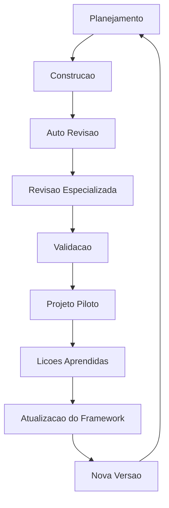

# Lifecycle da CEIP

## Objetivo

Definir o ciclo contínuo de evolução da CloudSix Engineering Intelligence Platform.

## Contexto

A CEIP deve evoluir como produto. Construir, revisar e validar uma vez não basta. Toda evolução deve passar por ciclo de maturidade com aprendizado e nova versão.

## Diretrizes

- Não interferir durante implementação em andamento.
- Após construção, revisar estrutura antes de conteúdo.
- Revisões especializadas devem ocorrer em rodadas separadas.
- Validação deve preceder piloto.
- Lições aprendidas devem atualizar framework e roadmap.

## Ciclo oficial

## Critérios por etapa

| Etapa | Critério de saída |
| --- | --- |
| Planejamento | Escopo, restrições e objetivo definidos |
| Construção | Artefatos criados sem interrupção |
| Auto Revisão | Estrutura validada |
| Revisão Especializada | Rodadas por especialista concluídas |
| Validação | Suíte `validation/` executada |
| Projeto Piloto | Projeto real analisado |
| Lições Aprendidas | Lacunas registradas |
| Atualização do Framework | Módulos ajustados |
| Nova Versão | Roadmap e changelog atualizados |

## Exemplos

- A criação do CLI só deve avançar depois do piloto indicar quais comandos reduzem fricção real.
- Uma lacuna de policy encontrada em review deve passar por atualização do Policy Engine.

## Checklist

- [ ] Etapa atual foi identificada.
- [ ] Critério de saída foi cumprido.
- [ ] Lições foram registradas.
- [ ] Nova versão foi planejada quando necessário.

## Conclusão

Lifecycle impede evolução aleatória e mantém a CEIP em melhoria contínua controlada.
