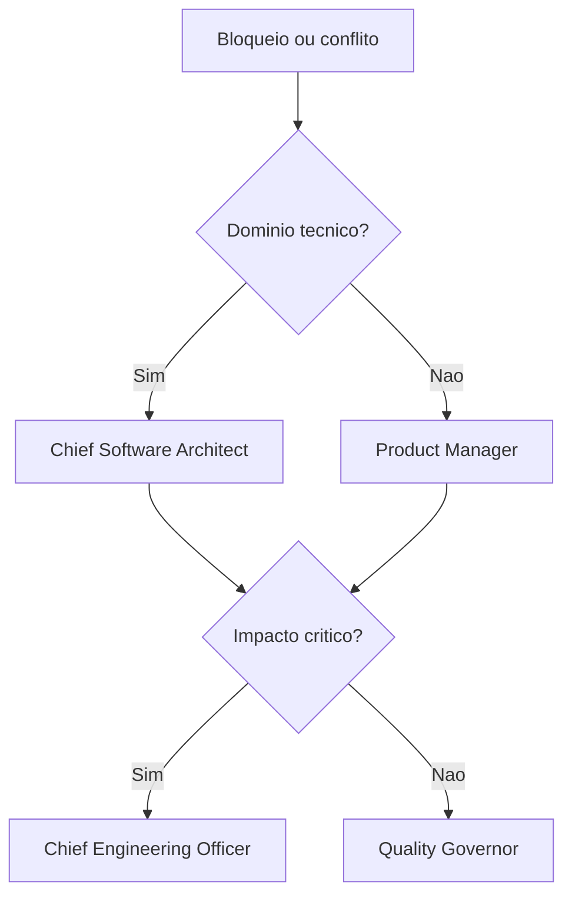

# Escalation Flow

## Objetivo

Definir quando uma decisão deve subir para meta-agentes, liderança técnica ou aprovação formal.

## Gatilhos

- Risco crítico.
- Gate bloqueado.
- Conflito entre agentes.
- Exceção de segurança.
- Mudança estrutural sem consenso.
- Impacto em produção, dados ou cliente.

## Fluxo

## Checklist

- [ ] Gatilho foi identificado.
- [ ] Responsável correto foi acionado.
- [ ] Decisão foi registrada.
- [ ] Exceção tem prazo e justificativa.

## Conclusão

Escalonamento existe para decisões que não devem ficar implícitas.
