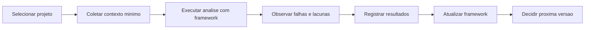

# Projetos Piloto

## Objetivo

Definir como testar o CloudSix Engineering Framework em projetos reais antes de ampliar adoção.

## Contexto

Validação documental não revela todas as lacunas. Um piloto em projeto real mostra se agentes, fluxos, gates, prompts e documentos funcionam quando confrontados com código, regras, dados e prazos reais.

## Diretrizes

- Escolher apenas um projeto no início.
- Não impor o framework em todos os projetos antes do piloto.
- Registrar onde a IA ficou perdida.
- Separar falha do framework de falta de contexto do projeto.
- Transformar aprendizados em ajustes de `knowledge/`, `validation/`, `recipes/`, `prompts/` ou `docs/`.

## Projeto sugerido

GSA Oficina, por reunir:

- Backend.
- Frontend.
- UX.
- Banco de dados.
- APIs.
- Regras de negócio.
- Responsividade.
- Relatórios.
- Fluxos complexos.

## Fluxo do piloto

## Exemplos

- Se a IA não souber qual agente acionar para relatório, ajustar `ORCHESTRATOR.md` ou `recipes/criar-relatorio.md`.
- Se a IA ignorar regra de negócio, reforçar prompts e validation.

## Checklist

- [ ] Projeto piloto foi escolhido.
- [ ] Objetivo do experimento foi definido.
- [ ] Critérios de observação foram preparados.
- [ ] Resultado será documentado.
- [ ] Aprendizados terão destino no framework.

## Conclusão

Piloto controlado reduz risco de adoção ampla e transforma o framework em ferramenta validada.
