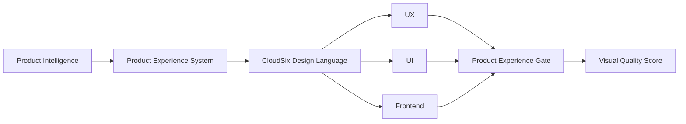

# CloudSix Design Language

## Objetivo

Definir a CloudSix Design Language (CDL) como linguagem de produto agnóstica de tecnologia para orientar qualidade visual, interação, densidade, acessibilidade e percepção premium em softwares da CloudSix.

## Posição na CEIP



## Definição

A CDL não é biblioteca de componentes, tema CSS, design system fechado, brand book ou recomendação de stack. Ela é um sistema de decisão para qualquer stack ou design system existente. Quando um projeto já possui linguagem visual própria, a CDL atua como régua de qualidade e coerência, não como substituição automática.

## Papel

- Dar vocabulário comum para Product, UX, UI, Frontend, QA e agentes de IA.
- Evitar interfaces funcionais, mas genéricas, confusas ou visualmente fracas.
- Preservar maturidade operacional sem impor tecnologia.
- Conectar decisões visuais a evidências, riscos e critérios de aceite.
- Permitir auditoria objetiva por Product Experience Gate e Visual Quality Score.

## Identidade Desejada

Produtos CloudSix devem transmitir:

- confiança;
- velocidade;
- organização;
- tecnologia;
- inteligência;
- simplicidade;
- precisão;
- maturidade operacional.

## Filosofia Operacional

```text
Menos ruído
Mais informação

Menos decoração
Mais hierarquia

Menos cores sem significado
Mais semântica visual

Menos componentes redundantes
Mais produtividade

Menos improviso
Mais consistência
```

## Regras Não Negociáveis

- A CDL nunca deve impor framework, biblioteca, kit visual, tema ou ferramenta.
- A CDL nunca deve copiar visual de benchmarks ou produtos externos.
- A CDL deve respeitar design system, marca, componentes e restrições reais do projeto.
- Toda decisão visual relevante deve ter justificativa operacional.
- Interfaces críticas exigem evidência, não apenas preferência estética.
- Desvios da CDL são permitidos somente com justificativa registrada.

## Camadas da CDL

| Camada | Decisão esperada | Evidência mínima |
| --- | --- | --- |
| Identidade | O produto transmite confiança, precisão e maturidade | Experience brief ou revisão visual |
| Hierarquia | Usuário entende prioridade, ação e contexto | Screenshot, wireframe ou especificação |
| Densidade | Tela mostra informação suficiente sem ruído | Justificativa por tarefa |
| Cor e semântica | Cores comunicam estado, risco e ação | Mapa de status ou tokens locais |
| Tipografia | Leitura é clara em títulos, labels, dados e erros | Captura ou guideline local |
| Espaçamento | Agrupamento revela relação entre elementos | Layout anotado ou componente revisado |
| Componentes | Componentes existem por função, não por decoração | Lista de componentes e motivo |
| Estados | Loading, vazio, erro, sucesso, disabled e permissão estão definidos | `interaction-states.md` local |
| Responsividade | A tarefa principal sobrevive aos viewports obrigatórios | Evidência por viewport |
| Acessibilidade | Contraste, foco e comunicação não dependem só de cor | Checklist ou teste manual |
| Motion | Movimento orienta feedback e não cria distração | Critério de uso ou ausência justificada |
| Memória | Padrões aprovados são reutilizáveis sem dados sensíveis | `experience-memory.md` local |

## Métricas Objetivas

| Métrica | Critério |
| --- | --- |
| Densidade de informação | A tela mostra informação suficiente sem sobrecarregar decisão |
| Ações primárias | Deve haver no máximo uma ação primária por contexto visual |
| Profundidade de navegação | Caminhos críticos devem evitar camadas desnecessárias |
| Hierarquia | Até três níveis visuais dominantes por região |
| Cores de status | Limitar variações para manter significado claro |
| Espaçamento | Agrupa por relação, separa por função e mantém ritmo consistente |
| Componentes | Componentes repetidos têm motivo operacional |
| Estados | Loading, vazio, erro, sucesso, disabled e permissão são definidos |
| Responsividade | Layout se adapta sem sobreposição ou perda da tarefa principal |
| Acessibilidade | Contraste, foco, alvos e comunicação não dependem só de cor |

## Fluxo de Decisão

1. Confirmar origem no Product Intelligence quando a demanda vier de produto, feature, módulo, API ou integração.
2. Identificar design system, componentes, marca, padrões existentes e restrições do projeto.
3. Preencher ou atualizar `.ceip/product-experience/cloudsix-design-language.md`.
4. Definir experience brief, telas afetadas, decisões de layout e estados.
5. Registrar conformidade em `.ceip/product-experience/cdl-compliance.md`.
6. Calcular Visual Quality Score proporcional ao risco.
7. Aplicar Product Experience Gate antes de UX/UI/Frontend final ou release.

## Integração Core + Workspace

No CEIP Core, a CDL vive neste documento e em `CDL_COMPLIANCE.md`.

No CEIP Workspace, cada projeto deve manter:

- `.ceip/product-experience/cloudsix-design-language.md`
- `.ceip/product-experience/cdl-compliance.md`
- `.ceip/product-experience/experience-brief.md`
- `.ceip/product-experience/design-decisions.md`
- `.ceip/product-experience/interaction-states.md`
- `.ceip/product-experience/visual-quality-score.md`

Esses arquivos guardam a aplicação local da CDL. Eles não devem copiar o Core nem armazenar dados sensíveis de clientes.

## Uso por Agentes

- Product Experience System usa a CDL para transformar requisitos em critérios de experiência.
- Frontend UX Specialist usa a CDL para jornada, estados e acessibilidade.
- UI Designer usa a CDL para composição visual, hierarquia, densidade e linguagem.
- Frontend Engineer usa a CDL para preservar intenção visual na implementação.
- QA Engineer usa a CDL como parte de testes visuais, responsivos e acessíveis.
- Code Reviewer / Tech Lead usa a CDL para bloquear interface tecnicamente funcional, mas desalinhada.

## Regras de Uso

- Use a CDL para avaliar decisões visuais, não para impor ferramenta.
- Respeite design system e marca do projeto quando existirem.
- Registre desvios quando uma regra não se aplicar ao domínio.
- Use benchmarks apenas para aprender princípios.
- Use Visual Quality Score para aprovar interfaces relevantes.

## Bloqueios

Uma interface deve ser bloqueada quando:

- texto, ação ou informação crítica ficam ilegíveis;
- elementos se sobrepõem ou quebram em viewport obrigatório;
- a ação principal não é identificável;
- estados críticos não foram definidos;
- informação de status depende apenas de cor;
- benchmark foi copiado como aparência;
- Visual Quality Score fica abaixo do mínimo por risco;
- não há registro local da CDL quando a interface é relevante.

## Checklist

- [ ] A interface tem identidade profissional.
- [ ] A densidade corresponde à tarefa.
- [ ] A ação primária é evidente.
- [ ] Cores e componentes têm significado.
- [ ] Estados e acessibilidade foram documentados.
- [ ] CDL local foi registrada no Workspace quando aplicável.
- [ ] Conformidade CDL foi revisada.
- [ ] A decisão não depende de stack específica.

## Conclusão

A CDL transforma a ambição de software premium em critérios auditáveis que agentes de IA, designers, frontend e QA conseguem aplicar.
