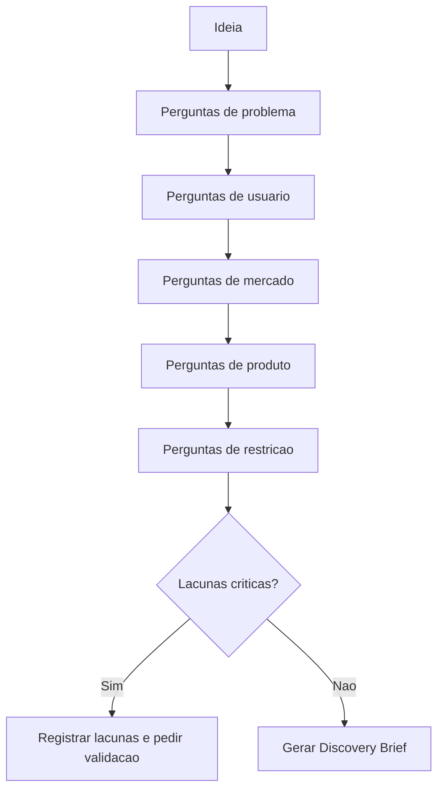

# Discovery Framework

## Objetivo

Definir o método de descoberta usado pelo Product Intelligence System para transformar uma ideia vaga em entendimento estruturado.

## Princípios

- Perguntar antes de propor.
- Separar fato, hipótese e opinião.
- Entender o problema antes da solução.
- Identificar usuários reais e situações de uso.
- Registrar lacunas em vez de inventar respostas.
- Validar valor antes de discutir arquitetura.

## Questionário base

### Problema

- Qual problema está sendo resolvido?
- Quem sofre esse problema?
- Com que frequência o problema acontece?
- Qual o impacto financeiro, operacional ou reputacional?
- Como o problema é resolvido hoje?
- O que acontece se nada for feito?

### Usuários e stakeholders

- Quem usa diretamente?
- Quem aprova?
- Quem opera?
- Quem recebe impacto indireto?
- Existe usuário interno e externo?
- Existem perfis com permissões diferentes?

### Mercado e concorrência

- Existem concorrentes diretos?
- Quais alternativas o usuário usa hoje?
- O diferencial desejado é claro?
- O mercado já espera algum padrão de experiência?
- Existem oportunidades de posicionamento?

### Produto

- Qual resultado define sucesso?
- Qual é o MVP?
- O que fica fora do MVP?
- Quais fluxos são críticos?
- Quais métricas serão acompanhadas?
- Existem dependências externas?

### Restrições

- Existe restrição legal?
- Existe restrição técnica?
- Existe restrição financeira?
- Existe prazo obrigatório?
- Existem dados sensíveis?
- Existem integrações obrigatórias?

## Fluxo

## Saída mínima

- problema;
- público;
- contexto atual;
- alternativas existentes;
- diferencial;
- restrições;
- hipóteses;
- riscos;
- próximos passos;
- recomendação de avanço ou bloqueio.

## Checklist

- [ ] Problema foi descrito sem solução embutida.
- [ ] Usuários e stakeholders foram mapeados.
- [ ] Alternativas atuais foram identificadas.
- [ ] Concorrentes ou substitutos foram registrados.
- [ ] Restrições foram explicitadas.
- [ ] MVP foi discutido.
- [ ] Lacunas foram registradas.

## Conclusão

Discovery é a etapa que protege a CEIP contra ambiguidade. Sem discovery suficiente, o PIS não deve liberar arquitetura ou implementação.
